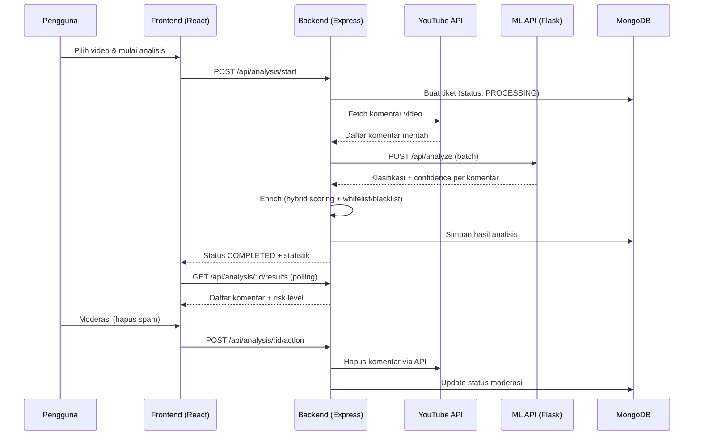
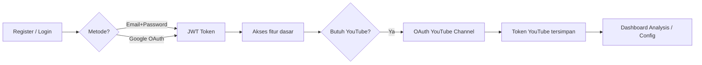
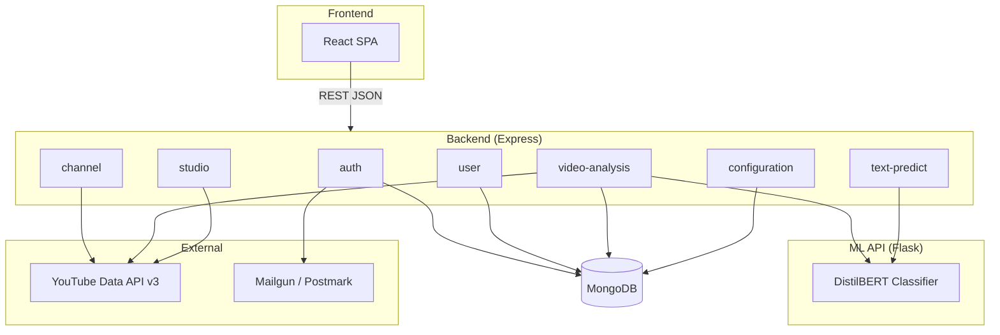

# Judi Guard — Dokumentasi Global (Source of Truth)

> **Dokumen ini adalah sumber kebenaran utama** untuk seluruh proyek Judi Guard.  
> Dokumentasi per-paket: [Backend](./backend/README.md) · [Frontend](./frontend/README.md) · [ML API](./ml-api/README.md)

---

## 1. Nama & Deskripsi Aplikasi

| Atribut        | Nilai                                    |
| -------------- | ---------------------------------------- |
| **Nama**       | Judi Guard (v2)                          |
| **Tagline**    | Say Goodbye to Spam Judi with Judi Guard |
| **Tipe**       | Aplikasi web berbasis AI (monorepo)      |
| **Lisensi**    | MIT                                      |
| **Pengembang** | Kamaldev10 (Ali Musthafa Kamal)          |

**Judi Guard** adalah aplikasi web yang membantu kreator konten dan pengelola channel YouTube dalam **mendeteksi, menganalisis, dan memoderasi komentar spam judi online** secara lebih efektif.

Aplikasi dikembangkan berdasarkan **Product Requirements Document (PRD)** dan penelitian skripsi, dengan pendekatan **Behaviour Driven Development (BDD)** agar pengembangan berfokus pada perilaku dan kebutuhan pengguna nyata.

---

## 2. Teknologi

### 2.1 Ringkasan Stack

| Layer            | Teknologi                                                  | Versi / Catatan               |
| ---------------- | ---------------------------------------------------------- | ----------------------------- |
| **Frontend**     | React + Vite, Tailwind CSS, Zustand                        | React 19, Vite 6              |
| **Backend**      | Node.js, Express, MongoDB (Mongoose)                       | Node ≥ 20, Express 5, ESM     |
| **ML API**       | Python, Flask, TensorFlow, Hugging Face Transformers       | Python 3.11, DistilBERT       |
| **Database**     | MongoDB                                                    | Local / Atlas / Docker        |
| **Testing**      | Cypress (E2E BDD), Vitest (unit/integration FE), Jest (BE) | Cypress di root repo          |
| **External API** | YouTube Data API v3, Google OAuth 2.0 (roadmap: TikTok/Instagram) | Wajib untuk integrasi channel |
| **Email**        | Mailgun / Postmark                                         | Reset password & OTP          |
| **Deployment**   | Docker Compose, Hugging Face Spaces (ML API)               | Monorepo `packages/`          |

### 2.2 Struktur Monorepo

```bash
judi-guard-app/
├── packages/
│   ├── frontend/       # Client React (workspace: client)
│   ├── backend/        # Server Express (workspace: server)
│   └── ml-api/         # Layanan ML Flask (Python, terpisah)
├── cypress/            # BDD End-to-End Testing (root)
├── docs/               # Dokumentasi global (folder ini)
├── docker-compose.yml
└── package.json        # Root workspace scripts
```

### 2.3 Port & URL Default (Development)

| Layanan           | Port  | URL                         |
| ----------------- | ----- | --------------------------- |
| Frontend (Vite)   | 5173  | `http://localhost:5173`     |
| Backend (Express) | 3001  | `http://localhost:3001/api` |
| ML API (Flask)    | 7860  | `http://localhost:7860`     |
| MongoDB           | 27017 | `mongodb://localhost:27017` |

---

## 3. Fitur Utama

| Fitur                         | Deskripsi                                                         | Modul Terkait                            |
| ----------------------------- | ----------------------------------------------------------------- | ---------------------------------------- |
| **Deteksi Spam Otomatis**     | Klasifikasi komentar JUDI / NON_JUDI via model DistilBERT         | ML API, `video-analysis`, `text-predict` |
| **Skor Kepercayaan & Risiko** | Hybrid scoring: AI + keyword + pola telepon/link + blacklist user | `ai.service.js`                          |
| **Indikator Transparan**      | Alasan deteksi (keyword, link, nomor HP, whitelist)               | Frontend `AnalysisResults`               |
| **Moderasi Komentar**         | Hapus individual & massal via YouTube API                         | `video-analysis`, `studio`               |
| **Riwayat & Laporan**         | Histori analisis, ekspor PDF                                      | `video-analysis`, `history`              |
| **Whitelist & Blacklist**     | Akun terpercaya & kata/pola kustom per user                       | `configuration`                          |
| **Integrasi YouTube**         | OAuth channel, fetch video & komentar                             | `channel`, `youtube.service`             |
| **Autentikasi**               | Register, login, OTP, Google OAuth, reset password                | `auth`, `user`                           |
| **Prediksi Teks (Demo)**      | Uji klasifikasi teks tanpa analisis video penuh                   | `text-predict`                           |
| **Dashboard Kreator**         | Overview channel, panduan, konfigurasi                            | Frontend `/dashboard/*`                  |

---

## 4. Alur Kerja Sistem

### 4.1 Alur Analisis Video (End-to-End)



### 4.2 Alur Autentikasi & Akses YouTube



---

## 5. Perbandingan: Kondisi Saat Ini vs Rekomendasi

### 5.1 Arsitektur Backend

| Aspek             | Saat Ini                                           | Rekomendasi (Best Practice)                | Status                      |
| ----------------- | -------------------------------------------------- | ------------------------------------------ | --------------------------- |
| Struktur folder   | Feature modules (`modules/`) + `shared/`           | Feature modules per bounded context        | ✅ Sudah diterapkan         |
| Module system     | ESM (`"type": "module"`)                           | ESM dengan import alias (`#modules/*`)     | ✅ Sudah diterapkan         |
| Layering          | Routes → Controller → Service → Repository → Model | Routes → Controller → DTO → Service → Repository → Model | ⚠️ DTO sedang distandarkan |
| Validasi input    | Joi di `*.validator.js`                            | Joi/Zod di boundary HTTP                   | ✅ Sudah diterapkan         |
| Error handling    | Centralized `error-handler.js`                     | Typed errors + correlation ID              | ⚠️ Correlation ID belum ada |
| Observability     | `morgan` logging                                   | Structured logging + metrics (RED)         | ⚠️ Perlu peningkatan        |
| Resilience ML API | Timeout 60s di axios client                        | Circuit breaker + retry dengan backoff     | ⚠️ Perlu peningkatan        |
| Background jobs   | Analisis sinkron di request                        | Queue (Bull/BullMQ) untuk analisis panjang | ⚠️ Direkomendasikan         |
| Multi-platform social | YouTube-centric service                          | Port-Adapter (YouTube/TikTok/Instagram) + DTO normalisasi | ⚠️ Direkomendasikan |

### 5.2 Arsitektur Frontend

| Aspek               | Saat Ini                                                   | Rekomendasi (frontend-architecture)    | Status                   |
| ------------------- | ---------------------------------------------------------- | -------------------------------------- | ------------------------ |
| Struktur folder     | Layer-based (`components/`, `pages/`, `stores/`, `hooks/`) | Feature modules (`modules/{feature}/`) | ⚠️ Perlu migrasi         |
| Server state        | Disimpan di Zustand store (fetch di store)                 | TanStack Query / RTK Query             | ⚠️ Perlu migrasi         |
| UI state            | Zustand (`step`, `filters`, loading flags)                 | Zustand per modul (hanya UI state)     | ⚠️ Sebagian sudah benar  |
| API client          | `lib/services/apiClient.js` (Axios)                        | `shared/api-client/` + hooks per modul | ⚠️ Perlu restrukturisasi |
| Styling             | Tailwind inline di JSX                                     | Co-located `*.styles.ts` per page      | ⚠️ Perlu standarisasi    |
| Cross-module import | Deep import (`@/components/...`)                           | Barrel-only (`@/modules/{feature}`)    | ⚠️ Perlu migrasi         |
| Routing             | `routes/AppRouter.jsx` (thin)                              | Tetap thin, mount dari module barrel   | ✅ Pola sudah benar      |

### 5.3 ML API

| Aspek            | Saat Ini                               | Rekomendasi                              | Status                             |
| ---------------- | -------------------------------------- | ---------------------------------------- | ---------------------------------- |
| Model serving    | Flask + TensorFlow CPU, single process | Gunicorn workers + health check          | ⚠️ Health check ada, workers belum |
| Batch processing | Loop sequential di `/api/analyze`      | Batch inference (tensor batching)        | ⚠️ Optimasi performa               |
| Deployment       | Hugging Face Spaces (Docker)           | HF Spaces + fallback lokal               | ✅ Sudah dikonfigurasi             |
| Versioning model | `saved_model/` statis                  | Model registry + version tag di response | ⚠️ Direkomendasikan                |

### 5.4 Testing & QA

| Aspek            | Saat Ini                          | Rekomendasi                            | Status              |
| ---------------- | --------------------------------- | -------------------------------------- | ------------------- |
| E2E              | Cypress BDD (Gherkin) di root     | Tetap Cypress BDD sebagai UAT otomatis | ✅ Sudah diterapkan |
| Unit FE          | Vitest (komponen & store)         | Vitest + Testing Library per modul     | ✅ Sebagian ada     |
| Unit BE          | Jest (`comment-deletion.test.js`) | Jest per service/repository            | ⚠️ Perlu perluasan  |
| Contract testing | Belum ada                         | Pact antara BE ↔ ML API                | ❌ Belum ada        |

---

## 6. Bounded Context & Tanggung Jawab Layanan



| Bounded Context  | Tanggung Jawab                                     | Endpoint Prefix |
| ---------------- | -------------------------------------------------- | --------------- |
| `auth`           | Register, login, OTP, Google OAuth, reset password | `/api/auth`     |
| `user`           | Profil pengguna, update data                       | `/api/users`    |
| `channel`        | Video channel, pencarian video, komentar preview   | `/api/videos`   |
| `video-analysis` | Analisis, hasil, moderasi, riwayat                 | `/api/analysis` |
| `configuration`  | Whitelist akun, blacklist kata                     | `/api/config`   |
| `studio`         | Integrasi YouTube Studio                           | `/api/studio`   |
| `text-predict`   | Prediksi teks tunggal (demo)                       | `/api/predict`  |

---

## 7. Variabel Lingkungan Penting

### Backend (`packages/backend/.env`)

```ini
PORT=3001
MONGODB_URI=mongodb://localhost:27017/judiguard
JWT_SECRET=<secret>
YOUTUBE_CLIENT_ID=<id>
YOUTUBE_CLIENT_SECRET=<secret>
YOUTUBE_REDIRECT_URI=<uri>
YOUTUBE_API_KEY=<key>
ML_API_URL=http://localhost:7860
MAILGUN_API_KEY=<key>
MAILGUN_DOMAIN=<domain>
```

### Frontend (`packages/frontend/.env`)

```ini
VITE_API_URL=http://localhost:3001
```

### ML API

```ini
PORT=7860
FLASK_DEBUG=false
```

---

## 8. Menjalankan Proyek

### Prasyarat

- Node.js ≥ 20.x
- npm
- Python 3.11+ (untuk ML API)
- MongoDB (local atau Docker)
- Akun Google Developer (YouTube API)

### Perintah Root

```bash
# Install semua workspace
npm install

# Jalankan FE + BE bersamaan
npm run dev

# Jalankan ML API (butuh venv)
npm run dev:ml

# Cypress E2E
npm run cy:open
```

### Docker Compose

```bash
docker compose up --build
```

> **Catatan:** Service `ml-api` di `docker-compose.yml` saat ini dikomentari. Aktifkan jika ingin menjalankan ML API via container.

---

## 9. Strategi Pengujian (BDD)

Pengembangan menggunakan **Behaviour Driven Development (BDD)**:

1. User stories & skenario Gherkin disusun dari PRD
2. Perilaku sistem menjadi fokus utama
3. Cypress di root repo menjalankan **Automated UAT** (Frontend + Backend)
4. Vitest/Jest untuk unit & integration test per paket

**Lokasi test E2E:** `cypress/` (root)  
**Lokasi test FE:** `packages/frontend/src/**/__tests__/`  
**Lokasi test BE:** `packages/backend/test/`

---

## 10. Dokumentasi Terkait

| Dokumen               | Lokasi                                                               | Isi                                    |
| --------------------- | -------------------------------------------------------------------- | -------------------------------------- |
| Backend architecture  | [docs/backend/README.md](./backend/README.md)                        | Arsitektur API, modul, pola resilience |
| Frontend architecture | [docs/frontend/README.md](./frontend/README.md)                      | Struktur modul, state split, migrasi   |
| ML API                | [docs/ml-api/README.md](./ml-api/README.md)                          | Model, endpoint, integrasi             |
| Migrasi ESM Backend   | [esm_feature_module_migration.md](./esm_feature_module_migration.md) | Rencana & status migrasi backend       |
| YouTube Data API v3   | [youtube_data_api_v3.md](./youtube_data_api_v3.md)                   | Referensi integrasi YouTube            |

---

## 11. Keputusan Arsitektural (ADR Ringkas)

| Keputusan                     | Alasan                                                       | Alternatif yang Ditolak                              |
| ----------------------------- | ------------------------------------------------------------ | ---------------------------------------------------- |
| Monorepo npm workspaces       | Satu repo, shared scripts, Cypress terpusat                  | Multi-repo terpisah                                  |
| Feature modules di backend    | Bounded context jelas, skalabilitas tim                      | Layer-based (`controllers/`, `services/`)            |
| DistilBERT via Flask terpisah | Isolasi inferensi ML, deploy independen di HF Spaces         | Inferensi langsung di Node.js                        |
| Hybrid scoring (AI + rules)   | Transparansi indikator, kontrol user via whitelist/blacklist | AI-only tanpa explainability                         |
| Zustand di frontend           | Ringan, familiar tim                                         | Redux Toolkit (lebih berat untuk kebutuhan saat ini) |
| BDD Cypress di root           | UAT otomatis lintas FE+BE                                    | Test terpisah per paket tanpa E2E                    |

---

_Terakhir diperbarui: Juli 2026_
