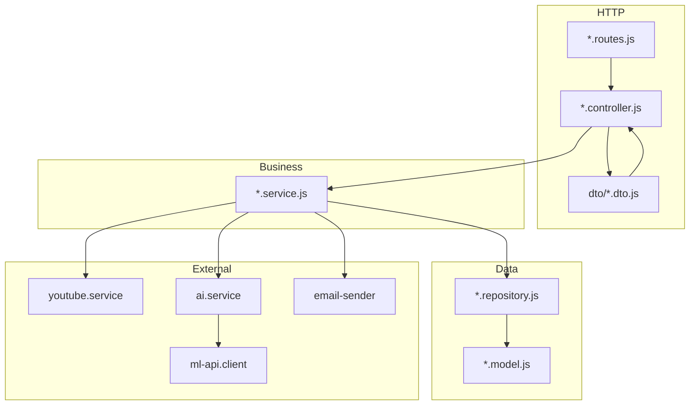
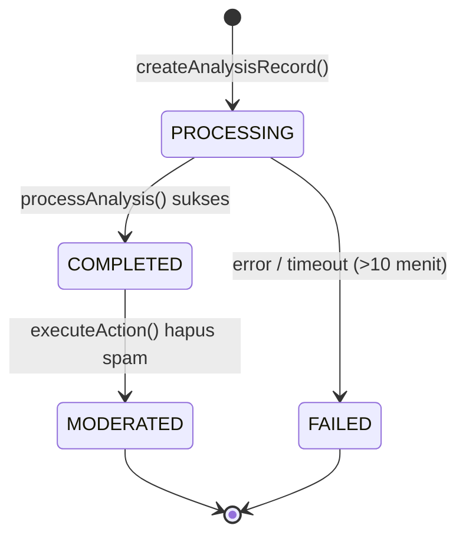
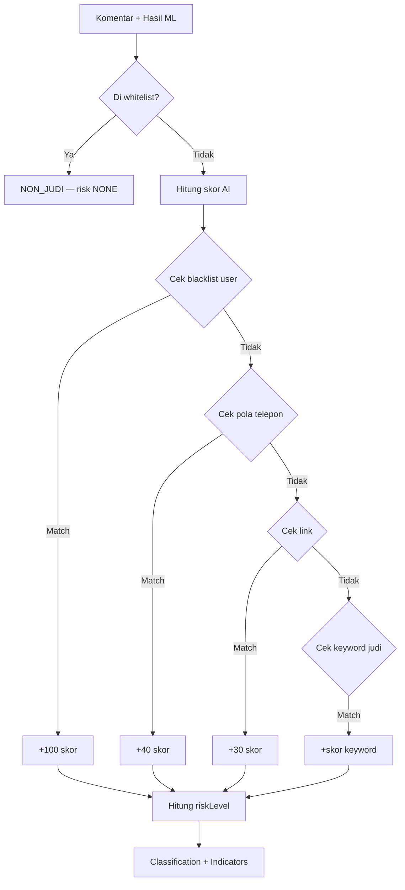
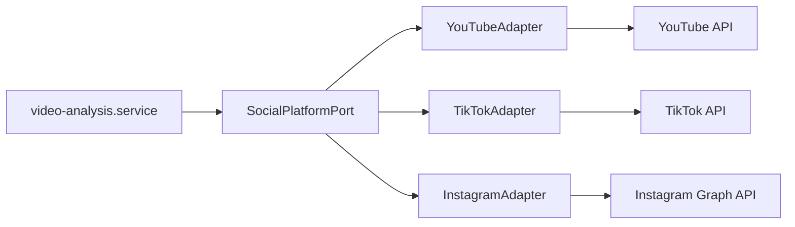
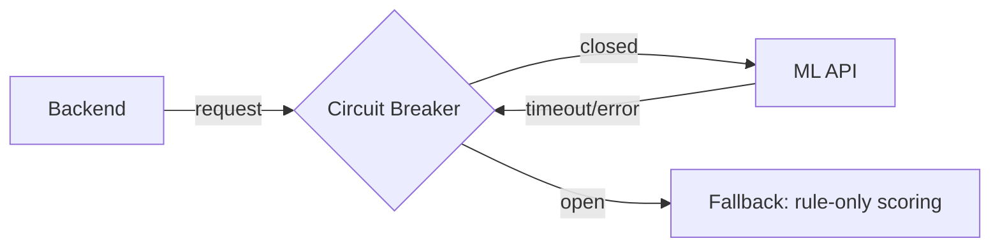
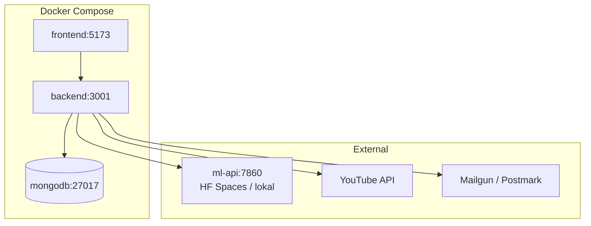

# Judi Guard — Dokumentasi Backend (Source of Truth)

> Sumber kebenaran teknis untuk `packages/backend/`.  
> Kembali ke [dokumentasi global](../README.md).

---

## 1. Ringkasan

Backend Judi Guard adalah **server-side service** berbasis **Node.js + Express 5 (ESM)** yang menangani:

- Autentikasi & otorisasi (JWT, Google OAuth, RBAC multi-role)
- Manajemen **Workspace** multi-tenant + RBAC permission system
- Integrasi YouTube Data API v3 (fetch komentar, moderasi, OAuth token refresh)
- Orkestrasi analisis komentar (fetch → ML → enrich → simpan)
- Moderasi komentar via YouTube API
- Manajemen konfigurasi user (whitelist/blacklist)
- Pengiriman email (reset password, OTP via Mailgun/Postmark)
- Generate laporan PDF (moderation report, period report)

---

## 2. Teknologi

| Komponen      | Pilihan                          | Versi              |
| ------------- | -------------------------------- | ------------------ |
| Runtime       | Node.js                          | ≥ 20.x             |
| Framework     | Express.js                       | 5.x                |
| Module system | ESM                              | `"type": "module"` |
| Database      | MongoDB + Mongoose               | 8.x                |
| Validasi      | Joi                              | 17.x               |
| Auth          | JWT + Google OAuth 2.0           | —                  |
| HTTP Client   | Axios                            | —                  |
| Email         | Mailgun / Postmark / Nodemailer  | —                  |
| Security      | Helmet, express-rate-limit, CORS | —                  |
| PDF           | PDFKit                           | —                  |
| Logging       | Morgan                           | —                  |
| Cookies       | cookie-parser                    | —                  |
| Password      | bcryptjs                         | —                  |
| Dev tool      | Nodemon, ESLint, Prettier        | —                  |
| Testing       | Jest + Supertest                 | —                  |

---

## 3. Arsitektur Layanan

### 3.1 Pola Arsitektur

Backend mengikuti **Feature Module Architecture** dengan **Repository Pattern** dan pemisahan lapisan ketat:



### 3.2 Aturan Lapisan

| Lapisan        | Tanggung Jawab                                  | Larangan                |
| -------------- | ----------------------------------------------- | ----------------------- |
| **Routes**     | Mount middleware, delegasi ke controller        | Logika bisnis           |
| **Controller** | Parse request, panggil service, format response | Query database langsung |
| **Service**    | Aturan bisnis, orkestrasi API eksternal         | Detail implementasi DB  |
| **Repository** | Query Mongoose (`find`, `create`, `update`)     | Logika bisnis           |
| **Model**      | Skema, indeks, validasi DB, hooks               | Logika aplikasi         |

### 3.4 Struktur Folder

```bash
packages/backend/src/
├── app/
│   ├── api.routes.js       # Router utama (/api/*)
│   ├── app.js              # Express app setup
│   └── server.js           # Entry point
├── config/
│   ├── database.js         # Koneksi MongoDB
│   └── environment.js      # Env vars terpusat
├── middlewares/
│   ├── error-handler.js         # Global error handler (Mongoose, JWT, Axios, dll)
│   ├── require-auth.js          # Auth + workspace auto-init + membership check
│   ├── require-permission.js    # RBAC permission checker (owner/admin/member)
│   ├── require-youtube-access.js# YouTube token verification & auto-refresh
│   └── validate-request.js      # Joi validation wrapper
├── modules/
│   ├── auth/
│   ├── channel/
│   ├── configuration/
│   ├── studio/
│   ├── text-predict/
│   ├── user/
│   ├── video-analysis/
│   └── workspace/            # RBAC multi-tenant (BARU)
└── shared/
    ├── clients/            # ml-api.client, google-oauth2.client
    ├── constants/          # gambling-keywords
    ├── services/           # ai.service, youtube.service
    └── utils/              # errors, jwt, pdf-generator, youtube-helper, dll.
```

### 3.5 Import Alias (ESM)

```json
{
  "#app/*": "./src/app/*",
  "#config/*": "./src/config/*",
  "#middlewares/*": "./src/middlewares/*",
  "#modules/*": "./src/modules/*",
  "#shared/*": "./src/shared/*"
}
```

---

## 4. Bounded Context & API Contract

### 4.1 Peta Endpoint

| Prefix             | Modul          | Deskripsi                                           |
| ------------------ | -------------- | --------------------------------------------------- |
| `GET /api/health`  | app            | Health check                                        |
| `/api/auth/*`      | auth           | Register, login, OTP, OAuth, reset password         |
| `/api/users/*`     | user           | Profil & manajemen user                             |
| `/api/analysis/*`  | video-analysis | Start, status, hasil, moderasi, riwayat, report PDF |
| `/api/videos/*`    | channel        | Video channel, search, preview komentar             |
| `/api/config/*`    | configuration  | Whitelist & blacklist                               |
| `/api/studio/*`    | studio         | Integrasi YouTube Studio (link moderasi)            |
| `/api/predict/*`   | text-predict   | Prediksi teks tunggal                               |
| `/api/workspace/*` | workspace      | Manajemen anggota, role, permission overrides       |

#### Detail Endpoint — Auth (`/api/auth/*`)

| Method  | Endpoint                 | Middleware                                    | Deskripsi                   |
| ------- | ------------------------ | --------------------------------------------- | --------------------------- |
| `POST`  | `/register`              | authLimiter, validate(registerSchema)         | Registrasi user baru        |
| `POST`  | `/verify-otp`            | authLimiter, validate(otpSchema)              | Verifikasi kode OTP         |
| `POST`  | `/resend-otp`            | authLimiter, validate(emailSchema)            | Kirim ulang OTP             |
| `POST`  | `/login`                 | authLimiter, validate(loginSchema)            | Login email + password      |
| `POST`  | `/google/signin`         | validate(googleLoginSchema)                   | Login/register via Google   |
| `GET`   | `/youtube/connect`       | requireAuth, youtube:connect                  | Redirect ke Google OAuth    |
| `GET`   | `/youtube/callback`      | requireAuth, youtube:connect                  | Handle OAuth callback       |
| `POST`  | `/youtube/disconnect`    | requireAuth, youtube:connect                  | Putus koneksi YouTube       |
| `GET`   | `/youtube/profile`       | requireAuth, youtube:connect, requireYTAccess | Ambil profil YouTube        |
| `POST`  | `/forgot-password`       | authLimiter, validate(forgotPasswordSchema)   | Kirim email reset password  |
| `PUT`   | `/reset-password/:token` | validate(resetPasswordSchema)                 | Reset password dengan token |
| `PATCH` | `/change-password`       | requireAuth, profile:write, validate          | Ganti password              |
| `POST`  | `/refresh`              | authLimiter, validate(refreshTokenSchema)     | Tukar refresh token → access token baru     |
| `POST`  | `/logout`               | requireAuth                                   | Blacklist access + hapus refresh token      |
| `ALL`   | `/guest/*`              | —                                             | **DEPRECATED** (410)        |

#### Detail Endpoint — Users (`/api/users/*`)

| Method  | Endpoint    | Middleware                 | Deskripsi             |
| ------- | ----------- | -------------------------- | --------------------- |
| `GET`   | `/me`       | requireAuth, profile:read  | Ambil profil sendiri  |
| `PATCH` | `/updateMe` | requireAuth, profile:write | Update profil sendiri |
| `DEL`   | `/deleteMe` | requireAuth, profile:write | Hapus akun sendiri    |

#### Detail Endpoint — Analysis (`/api/analysis/*`)

| Method | Endpoint                   | Middleware                                   | Deskripsi                           |
| ------ | -------------------------- | -------------------------------------------- | ----------------------------------- |
| `GET`  | `/history`                 | requireAuth, analysis:read                   | Riwayat analisis user               |
| `POST` | `/:videoId`                | requireAuth, analysis:start, requireYTAccess | Mulai analisis video                |
| `GET`  | `/status/:analysisId`      | requireAuth, analysis:read                   | Cek status analisis                 |
| `GET`  | `/:analysisId/results`     | requireAuth, analysis:read                   | Ambil hasil analisis                |
| `POST` | `/:analysisId/action`      | requireAuth, analysis:moderate, reqYTAccess  | Eksekusi aksi moderasi              |
| `POST` | `/:analysisId/undo`        | requireAuth, analysis:moderate, reqYTAccess  | Undo aksi moderasi                  |
| `GET`  | `/report/preview`          | requireAuth, analysis:report                 | Preview laporan period              |
| `GET`  | `/report/download`         | requireAuth, analysis:report                 | Download laporan period (PDF)       |
| `GET`  | `/:analysisId/report/pdf`  | requireAuth, analysis:report                 | Download laporan per analisis (PDF) |
| `ALL`  | `/videos/*`, `/comments/*` | —                                            | **DEPRECATED** (410)                |

#### Detail Endpoint — Channel (`/api/videos/*`)

| Method | Endpoint             | Middleware                             | Deskripsi                 |
| ------ | -------------------- | -------------------------------------- | ------------------------- |
| `GET`  | `/`                  | requireAuth, channel:read, reqYTAccess | Daftar video user         |
| `GET`  | `/search`            | requireAuth, channel:read, reqYTAccess | Cari video berdasarkan ID |
| `GET`  | `/:videoId/comments` | requireAuth, channel:read, reqYTAccess | Preview komentar video    |

#### Detail Endpoint — Config (`/api/config/*`)

| Method | Endpoint         | Middleware                             | Deskripsi                |
| ------ | ---------------- | -------------------------------------- | ------------------------ |
| `POST` | `/whitelist`     | requireAuth, config:write, reqYTAccess | Tambah whitelist channel |
| `GET`  | `/whitelist`     | requireAuth, config:read, reqYTAccess  | Daftar whitelist         |
| `DEL`  | `/whitelist/:id` | requireAuth, config:write, reqYTAccess | Hapus whitelist          |
| `POST` | `/blacklist`     | requireAuth, config:write, reqYTAccess | Tambah blacklist kata    |
| `GET`  | `/blacklist`     | requireAuth, config:read, reqYTAccess  | Daftar blacklist         |
| `DEL`  | `/blacklist/:id` | requireAuth, config:write, reqYTAccess | Hapus blacklist          |

#### Detail Endpoint — Workspace (`/api/workspace/*`) **BARU**

| Method  | Endpoint                       | Middleware                                    | Deskripsi                    |
| ------- | ------------------------------ | --------------------------------------------- | ---------------------------- |
| `GET`   | `/members`                     | requireAuth, workspace:read                   | Daftar anggota workspace     |
| `POST`  | `/members`                     | requireAuth, workspace:invite, validate       | Undang anggota baru          |
| `DEL`   | `/members/:userId`             | requireAuth, workspace:remove                 | Hapus anggota dari workspace |
| `PATCH` | `/members/:userId/role`        | requireAuth, workspace:assign-role, validate  | Ubah role anggota            |
| `PATCH` | `/members/:userId/permissions` | requireAuth, rbac:assign-permission, validate | Override permission anggota  |

#### Detail Endpoint — Studio (`/api/studio/*`)

| Method | Endpoint                     | Middleware                 | Deskripsi                             |
| ------ | ---------------------------- | -------------------------- | ------------------------------------- |
| `GET`  | `/comments-link/:analysisId` | requireAuth, analysis:read | Link ke YouTube Studio untuk moderasi |

#### Detail Endpoint — Text Predict (`/api/predict/*`)

| Method | Endpoint | Middleware | Deskripsi             |
| ------ | -------- | ---------- | --------------------- |
| `POST` | `/`      | —          | Prediksi teks tunggal |

### 4.2 RBAC Permission Matrix

Setiap endpoint dilindungi oleh **permission check** via middleware `require-permission.js`. Berikut matriks permission per role:

| Permission               | owner | admin | member |
| ------------------------ | :---: | :---: | :----: |
| `profile:read`           |  ✅   |  ✅   |   ✅   |
| `profile:write`          |  ✅   |  ✅   |   ✅   |
| `analysis:start`         |  ✅   |  ✅   |   ✅   |
| `analysis:read`          |  ✅   |  ✅   |   ✅   |
| `analysis:moderate`      |  ✅   |  ✅   |   ✅   |
| `analysis:report`        |  ✅   |  ✅   |   ✅   |
| `config:read`            |  ✅   |  ✅   |   ✅   |
| `config:write`           |  ✅   |  ✅   |   ✅   |
| `channel:read`           |  ✅   |  ✅   |   ✅   |
| `youtube:connect`        |  ✅   |  ✅   |   ✅   |
| `workspace:read`         |  ✅   |  ✅   |   ❌   |
| `workspace:invite`       |  ✅   |  ❌   |   ❌   |
| `workspace:remove`       |  ✅   |  ❌   |   ❌   |
| `workspace:assign-role`  |  ✅   |  ❌   |   ❌   |
| `rbac:assign-permission` |  ✅   |  ❌   |   ❌   |
| `rbac:revoke-permission` |  ✅   |  ❌   |   ❌   |

**Permission Overrides**: Owner dapat memberikan override (grant/deny) permission spesifik kepada anggota via endpoint `PATCH /workspace/members/:userId/permissions`.

### 4.3 Alur Analisis Video (Detail)



**Langkah `processAnalysis()`:**

1. Fetch komentar dari YouTube (`youtube.service.getAllComments`)
2. Simpan komentar mentah ke `AnalyzedComment`
3. Kirim batch ke ML API (`POST /api/analyze`)
4. Enrich hasil ML dengan hybrid scoring (`ai.service.enrichPrediction`)
   - Skor AI (confidence × 100)
   - Deteksi nomor telepon, link, keyword judi
   - Override whitelist akun terpercaya
   - Override blacklist kata user
5. Hitung `riskLevel` (HIGH / MEDIUM / LOW / NONE)
6. Update statistik analisis & status `COMPLETED`

### 4.4 Hybrid Scoring (AI + Rules)



---

## 5. Middleware

### 5.1 require-auth.js

- Verifikasi JWT Bearer Token
- Auto-detect & validasi **active workspace** (dari header `x-workspace-id`, payload JWT, atau user default)
- **Auto-init workspace** jika user belum memiliki workspace (create workspace + owner membership)
- Set `req.auth = { userId, email, role, workspaceId }` dan `req.membership`

### 5.2 require-permission.js

- Cek permission eksplisit berdasarkan role atau override
- Evaluasi: override deny → override grant → fallback default role
- Support multiple permission (AND logic)

### 5.3 require-youtube-access.js

- Verifikasi token YouTube dari database
- **Auto-refresh token** jika expiry ≤ 5 menit (dengan mutex mencegah refresh ganda)
- Jika refresh gagal → hapus token DB → return 422
- Set `req.youtube = { tokens, channelId, channelName }`

### 5.4 validate-request.js

- Wrapper Joi validation untuk body/query/params

### 5.5 error-handler.js

- Centralized error handler
- Adapters: CastError (Mongoose), ValidationError, AxiosError, JWT errors, DuplicateKey (E11000)
- Operational vs Programming error separation (production mode)

---

## 6. Integrasi Eksternal

### 6.1 YouTube Data API v3

| Operasi            | Service                          | Scope OAuth         |
| ------------------ | -------------------------------- | ------------------- |
| List video channel | `channel.service`                | `youtube.readonly`  |
| Fetch komentar     | `youtube.service.getAllComments` | `youtube.force-ssl` |
| Hapus komentar     | `youtube.service.deleteComment`  | `youtube.force-ssl` |
| OAuth callback     | `auth.service`                   | —                   |

> Detail lengkap: [youtube_data_api_v3.md](../youtube_data_api_v3.md)

### 6.2 Ekspansi Multi-Platform (YouTube, TikTok, Instagram, dll)

Untuk ekspansi platform sosial tanpa mengubah core domain, gunakan pola **Port-Adapter (Hexagonal ringan)**:



#### Kontrak Port (stabil)

- `connectAccount(userId, authCode)`
- `refreshAccessToken(accountId)`
- `listVideosOrPosts(accountId, cursor)`
- `listComments(contentId, cursor)`
- `deleteComment(commentId)`
- `normalizeComment(rawComment) => PlatformCommentDto`

### 6.3 ML API Client

```javascript
// shared/clients/ml-api.client.js
export const mlApiClient = axios.create({
  baseURL: process.env.ML_API_URL || 'http://127.0.0.1:5000',
  timeout: 60000,
});
```

| Endpoint ML         | Dipanggil oleh               | Fungsi                  |
| ------------------- | ---------------------------- | ----------------------- |
| `POST /api/predict` | `text-predict`, `ai.service` | Prediksi tunggal        |
| `POST /api/analyze` | `ai.service`                 | Batch analisis komentar |
| `GET /health`       | — (belum digunakan)          | Health check            |

### 6.4 Email

- **Mailgun** (utama produksi) — reset password, OTP
- **Postmark** (alternatif) — dikonfigurasi di `environment.js`
- **Nodemailer** (fallback SMTP) — untuk development

---

## 7. Keamanan

| Aspek            | Implementasi Saat Ini                             | Rekomendasi                            |
| ---------------- | ------------------------------------------------- | -------------------------------------- |
| Autentikasi      | JWT Bearer di header `Authorization`              | ✅ Cukup untuk SPA                     |
| Otorisasi        | RBAC: `require-auth.js` + `require-permission.js` | ✅ Permission matrix + overrides       |
| Input validation | Joi di `validate-request.js`                      | ✅ Sudah ada                           |
| Rate limiting    | `express-rate-limit` (global + per-auth)          | ✅ Per-endpoint untuk `/auth`          |
| Security headers | Helmet (CSP disesuaikan untuk Google OAuth)       | ✅ Sudah ada                           |
| CORS             | Dikonfigurasi di `app.js` (whitelist origin)      | ✅ Restrict origin di produksi         |
| Secrets          | `.env` (tidak di-commit)                          | ⏳ Vault / Secrets Manager di produksi |

---

## 8. Resilience & Observability

### 8.1 Kondisi Saat Ini

| Pola                       | Status | Detail                                   |
| -------------------------- | ------ | ---------------------------------------- |
| Timeout ML API             | ✅     | 60 detik di `mlApiClient`                |
| Stuck analysis guard       | ✅     | Auto-fail setelah 10 menit `PROCESSING`  |
| Centralized error handler  | ✅     | `AppError`, `BadRequestError`, dll.      |
| YouTube token auto-refresh | ✅     | Mutex-protected, auto-cleanup jika gagal |
| Structured logging         | ⚠️     | `console.log` + `morgan`                 |
| Circuit breaker ML         | ❌     | Belum ada                                |
| Retry dengan backoff       | ❌     | Belum ada                                |
| Correlation ID             | ❌     | Belum ada                                |
| Health check               | ✅     | `GET /api/health`                        |

### 8.2 Rekomendasi Peningkatan



1. **Circuit breaker** untuk ML API (mis. `cockatiel`) — fallback ke rule-based scoring
2. **Background queue** (BullMQ) untuk analisis video panjang — hindari timeout HTTP
3. **Structured logging** (pino) dengan `requestId` per request
4. **Metrics** — rate, error, duration per endpoint (Prometheus / APM)

---

## 9. Data Model (Ringkas)

| Model             | Modul          | Tujuan                                    |
| ----------------- | -------------- | ----------------------------------------- |
| `User`            | user           | Akun pengguna, token YouTube, workspaceId |
| `PasswordReset`   | auth           | Token reset password                      |
| `UserConfig`      | configuration  | Whitelist channel ID, blacklist kata      |
| `RefreshToken`    | auth           | Refresh token untuk rotasi                |
| `TokenBlacklist`  | auth           | Blacklist access token JTI                |
| `VideoAnalysis`   | video-analysis | Tiket analisis, statistik, status         |
| `AnalyzedComment` | video-analysis | Komentar + hasil klasifikasi per analisis |
| `Workspace`       | workspace      | Entitas workspace multi-tenant **BARU**   |
| `WorkspaceMember` | workspace      | Membership + role + permission overrides  |

### Struktur Workspace & WorkspaceMember

```javascript
// Workspace
{
  name: String,           // required
  ownerUserId: ObjectId,  // ref: User, required
  timestamps: true
}

// WorkspaceMember
{
  userId: ObjectId,       // ref: User
  workspaceId: ObjectId,  // ref: Workspace (unique compound index)
  role: 'owner' | 'admin' | 'member',
  permissionOverrides: {
    grant: [String],      // permission tambahan
    deny: [String],       // permission dicabut
  }
}
```

---

## 10. Dokumentasi v2

Dokumentasi spesifikasi per-fitur backend v2:

| Berkas                                                                                   | Isi                                                                                  | Status         |
| ---------------------------------------------------------------------------------------- | ------------------------------------------------------------------------------------ | -------------- |
| [`v2/01_esm_feature_module_migration.md`](v2/01_esm_feature_module_migration.md)         | Migrasi ESM + Feature Module (struktur folder, subpath imports)                      | ✅ Selesai     |
| [`v2/02-rbac-auth-spesifikasi-final.md`](v2/02-rbac-auth-spesifikasi-final.md)           | RBAC, Auth, Workspace — spesifikasi final middleware chain & permission              | ✅ Selesai     |
| [`v2/03-audit-auth-flow.md`](v2/03-audit-auth-flow.md)                                   | Audit alur autentikasi & otorisasi — deep dive middleware chain, temuan, rekomendasi | ✅ Selesai     |
| [`v2/04-arsitektur-role-dan-batasan.md`](v2/04-arsitektur-role-dan-batasan.md)           | Arsitektur role final & batasan explorer — superuser, explorer, workspace auth       | 🔒 Selesai     |
| [`v2/05-task-plan-eksekusi-04.md`](v2/05-task-plan-eksekusi-04.md)                       | Task plan berurutan untuk mengeksekusi item yang belum dari 04                       | ✅ Selesai     |
| [`v2/06-clean-code-split-auth.md`](v2/06-clean-code-split-auth.md)                       | Audit clean code + rencana split auth module (otp, youtube, auth service)            | ✅ Selesai     |
| [`v2/07-refresh-token-dan-blacklist.md`](v2/07-refresh-token-dan-blacklist.md)           | Refresh token + blacklist token di DB untuk logout server-side                       | ✅ Selesai     |
| [`v2/08-strategi-testing-auth.md`](v2/08-strategi-testing-auth.md)                       | Strategi testing auth — unit 60 ✅, integration & e2e menyusul                      | ✅ Selesai     |
| [`v2/09-strategi-testing-middleware.md`](v2/09-strategi-testing-middleware.md)           | Strategi testing middleware — unit 38 ✅, integration 8 ✅                          | ✅ Selesai     |
| [`v2/00-rekomendasi-pengembangan-backend.md`](v2/00-rekomendasi-pengembangan-backend.md) | Rencana prioritas pengembangan backend selanjutnya                                   | 🔓 Rekomendasi |

---

## 11. Konvensi Penamaan

Mengikuti [esm_feature_module_migration.md](../esm_feature_module_migration.md):

| Elemen    | Konvensi               | Contoh                           |
| --------- | ---------------------- | -------------------------------- |
| Folder    | kebab-case             | `video-analysis/`                |
| File      | kebab-case + suffix    | `auth.controller.js`             |
| Kelas     | PascalCase             | `UserRepository`                 |
| Fungsi    | camelCase (kata kerja) | `findUserByEmail()`              |
| Boolean   | prefix `is/has/can`    | `isVerified`, `hasYoutubeAccess` |
| Konstanta | UPPER_SNAKE_CASE       | `MAX_TOP_LEVEL_COMMENTS`         |

---

## 11. Menjalankan Backend

```bash
cd packages/backend
npm install
cp .env.example .env   # sesuaikan variabel
npm run dev            # nodemon, port 3001
```

### Skrip

| Perintah       | Fungsi                     |
| -------------- | -------------------------- |
| `npm run dev`  | Development dengan Nodemon |
| `npm start`    | Production                 |
| `npm run test`  | Jest — unit + integration (timeout 180s) |
| `npm run test:unit` | Hanya `*.unit.test.js` (timeout 10s) |
| `npm run test:integration` | Hanya `*.integration.test.js` (timeout 30s) |
| `npm run lint` | ESLint                     |

### Dokumentasi API (Swagger)

Jika sudah aktif, buka:

```
http://localhost:3001/api-docs
```

---

## 12. Perbandingan: Saat Ini vs Rekomendasi

| Area           | Saat Ini                | Target Best Practice                                  |
| -------------- | ----------------------- | ----------------------------------------------------- |
| Struktur modul | Feature modules ✅      | Pertahankan, tambah README per modul                  |
| RBAC           | Workspace + permissions | ✅ Implementasi Fase 2 lengkap                        |
| Async analisis | Sinkron di HTTP request | Background job queue                                  |
| ML resilience  | Timeout saja            | Circuit breaker + retry + fallback                    |
| Logging        | Console + morgan        | Structured JSON + correlation ID                      |
| API docs       | README manual           | OpenAPI/Swagger auto-generated (✅ via swagger-jsdoc) |
| Testing        | Jest + Supertest — 60 unit tests ✅ | Unit per service + integration per route |
| Caching        | Tidak ada               | Redis cache untuk hasil analisis selesai              |

---

## 13. Diagram Deployment



---

_Terakhir diperbarui: 12 Juli 2026 — v2 ESM, RBAC, Workspace ✅, Auth unit tests 60/60 ✅_
