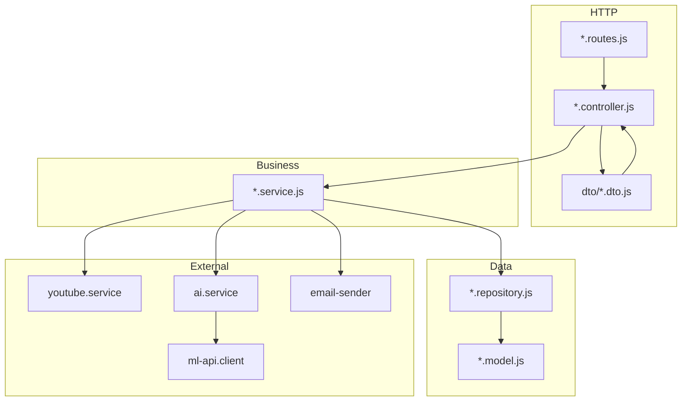
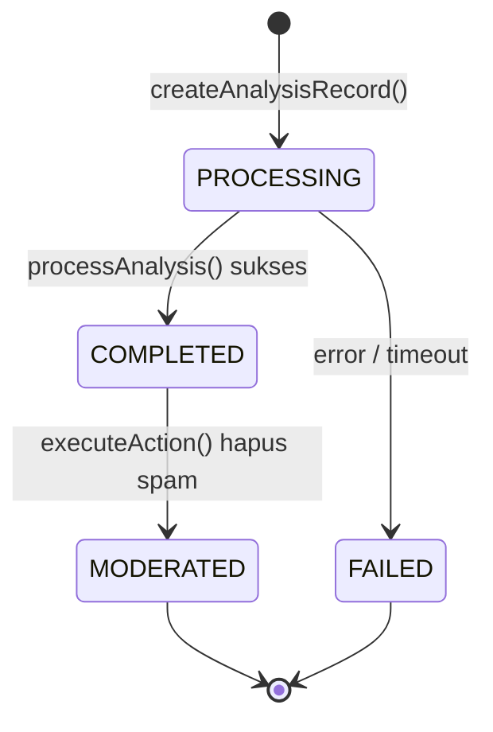
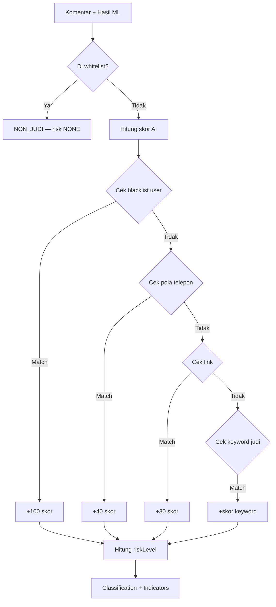
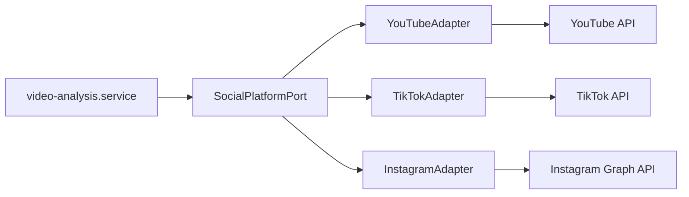
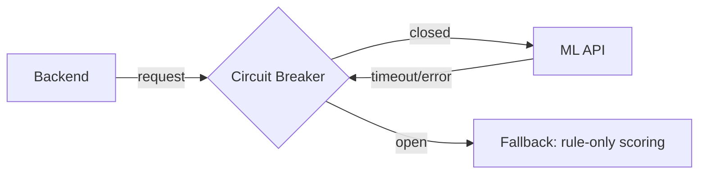
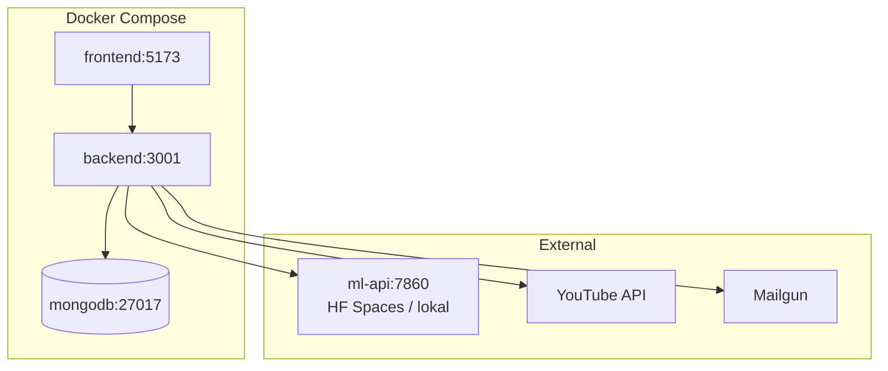

# Judi Guard — Dokumentasi Backend (Source of Truth)

> Sumber kebenaran teknis untuk `packages/backend/`.  
> Kembali ke [dokumentasi global](../README.md).

---

## 1. Ringkasan

Backend Judi Guard adalah **server-side service** berbasis **Node.js + Express 5 (ESM)** yang menangani:

- Autentikasi & otorisasi (JWT, Google OAuth)
- Integrasi YouTube Data API v3
- Orkestrasi analisis komentar (fetch → ML → enrich → simpan)
- Moderasi komentar via YouTube API
- Manajemen konfigurasi user (whitelist/blacklist)
- Pengiriman email (reset password, OTP)

---

## 2. Teknologi

| Komponen      | Pilihan                          | Versi              |
| ------------- | -------------------------------- | ------------------ |
| Runtime       | Node.js                          | ≥ 20.x             |
| Framework     | Express.js                       | 5.x                |
| Module system | ESM                              | `"type": "module"` |
| Database      | MongoDB + Mongoose               | 8.x                |
| Validasi      | Joi                              | 17.x               |
| Auth          | JWT + Google OAuth 2.0           | —                  |
| HTTP Client   | Axios                            | —                  |
| Email         | Mailgun / Postmark               | —                  |
| Security      | Helmet, express-rate-limit, CORS | —                  |
| Dev tool      | Nodemon                          | —                  |

---

## 3. Arsitektur Layanan

### 3.1 Pola Arsitektur

Backend mengikuti **Feature Module Architecture** dengan **Repository Pattern** dan pemisahan lapisan ketat, termasuk **lapisan DTO** untuk menjaga kontrak data antar layer:



### 3.2 Aturan Lapisan

| Lapisan        | Tanggung Jawab                                  | Larangan                |
| -------------- | ----------------------------------------------- | ----------------------- |
| **Routes**     | Mount middleware, delegasi ke controller        | Logika bisnis           |
| **Controller** | Parse request, panggil service, format response | Query database langsung |
| **DTO**        | Mapping request/response dan kontrak data stabil | Memanggil DB/API eksternal |
| **Service**    | Aturan bisnis, orkestrasi API eksternal         | Detail implementasi DB  |
| **Repository** | Query Mongoose (`find`, `create`, `update`)     | Logika bisnis           |
| **Model**      | Skema, indeks, validasi DB, hooks               | Logika aplikasi         |

### 3.3 Konvensi DTO

Gunakan DTO untuk menghindari kebocoran struktur data internal ke API publik:

- `request dto`: normalisasi input (`start-analysis.request.dto.js`)
- `service dto`: kontrak antar service (`analyze-comment.dto.js`)
- `response dto`: bentuk output API (`analysis-result.response.dto.js`)
- `integration dto`: adapter ke API eksternal (`youtube-comment.dto.js`, `tiktok-comment.dto.js`)

Contoh alur:

1. Controller menerima request mentah
2. Request diubah ke `request dto`
3. Service bekerja dengan `service dto` (domain-friendly)
4. Repository/model mengembalikan entitas
5. Controller memetakan ke `response dto` agar API stabil

### 3.4 Struktur Folder

```bash
packages/backend/src/
├── app/
│   ├── api.routes.js       # Router utama (/api/*)
│   ├── app.js              # Express app setup
│   └── server.js           # Entry point
├── config/
│   ├── database.js         # Koneksi MongoDB
│   └── environment.js      # Env vars terpusat
├── middlewares/
│   ├── ensure-youtube-access.js
│   ├── error-handler.js
│   ├── is-authenticated.js
│   └── validate-request.js
├── modules/
│   ├── auth/
│   ├── channel/
│   ├── configuration/
│   ├── studio/
│   ├── text-predict/
│   ├── user/
│   └── video-analysis/
├── dto/                    # Global DTO lintas modul (opsional)
└── shared/
    ├── clients/            # ml-api.client, google-oauth2.client
    ├── constants/          # gambling-keywords
    ├── services/           # ai.service, youtube.service
    └── utils/              # errors, jwt, pdf-generator, dll.
```

### 3.5 Import Alias (ESM)

```json
{
  "#app/*": "./src/app/*",
  "#config/*": "./src/config/*",
  "#middlewares/*": "./src/middlewares/*",
  "#modules/*": "./src/modules/*",
  "#shared/*": "./src/shared/*"
}
```

---

## 4. Bounded Context & API Contract

### 4.1 Peta Endpoint

| Prefix            | Modul          | Deskripsi                                   |
| ----------------- | -------------- | ------------------------------------------- |
| `GET /api/health` | app            | Health check                                |
| `/api/auth/*`     | auth           | Register, login, OTP, OAuth, reset password |
| `/api/users/*`    | user           | Profil & manajemen user                     |
| `/api/analysis/*` | video-analysis | Start, status, hasil, moderasi, riwayat     |
| `/api/videos/*`   | channel        | Video channel, search, preview komentar     |
| `/api/config/*`   | configuration  | Whitelist & blacklist                       |
| `/api/studio/*`   | studio         | Integrasi YouTube Studio                    |
| `/api/predict/*`  | text-predict   | Prediksi teks tunggal                       |

### 4.2 Alur Analisis Video (Detail)



**Langkah `processAnalysis()`:**

1. Fetch komentar dari YouTube (`youtube.service.getAllComments`)
2. Simpan komentar mentah ke `AnalyzedComment`
3. Kirim batch ke ML API (`POST /api/analyze`)
4. Enrich hasil ML dengan hybrid scoring (`ai.service.enrichPrediction`)
   - Skor AI (confidence × 100)
   - Deteksi nomor telepon, link, keyword judi
   - Override whitelist akun terpercaya
   - Override blacklist kata user
5. Hitung `riskLevel` (HIGH / MEDIUM / LOW / NONE)
6. Update statistik analisis & status `COMPLETED`

### 4.3 Hybrid Scoring (AI + Rules)



---

## 5. Integrasi Eksternal

### 5.1 YouTube Data API v3

| Operasi            | Service                          | Scope OAuth         |
| ------------------ | -------------------------------- | ------------------- |
| List video channel | `channel.service`                | `youtube.readonly`  |
| Fetch komentar     | `youtube.service.getAllComments` | `youtube.force-ssl` |
| Hapus komentar     | `youtube.service.deleteComment`  | `youtube.force-ssl` |
| OAuth callback     | `auth.service`                   | —                   |

> Detail lengkap: [youtube_data_api_v3.md](../youtube_data_api_v3.md)

### 5.2 Ekspansi Multi-Platform (YouTube, TikTok, Instagram, dll)

Untuk ekspansi platform sosial tanpa mengubah core domain, gunakan pola **Port-Adapter (Hexagonal ringan)**:



#### Kontrak Port (stabil)

- `connectAccount(userId, authCode)`
- `refreshAccessToken(accountId)`
- `listVideosOrPosts(accountId, cursor)`
- `listComments(contentId, cursor)`
- `deleteComment(commentId)`
- `normalizeComment(rawComment) => PlatformCommentDto`

#### Struktur folder yang disarankan

```bash
src/
├── modules/
│   ├── social-account/              # akun platform user (tokens, scopes, status)
│   ├── content-source/              # daftar video/post lintas platform
│   └── video-analysis/              # engine analisis (platform-agnostic)
├── platforms/
│   ├── contracts/
│   │   └── social-platform.port.js
│   ├── youtube/
│   │   ├── youtube.adapter.js
│   │   └── youtube.dto.js
│   ├── tiktok/
│   │   ├── tiktok.adapter.js
│   │   └── tiktok.dto.js
│   └── instagram/
│       ├── instagram.adapter.js
│       └── instagram.dto.js
└── dto/
    └── platform-comment.dto.js
```

#### Prinsip scalability & maintainability

1. **Open/Closed Principle**: tambah platform baru cukup tambah adapter baru, service inti tidak diubah.
2. **Single Responsibility**: setiap adapter hanya tahu API platform masing-masing.
3. **DTO Normalization**: komentar dari semua platform dipetakan ke satu DTO netral domain.
4. **Per-platform capability flags**: tidak semua platform mendukung aksi sama (mis. delete/reply), tangani lewat capability matrix.
5. **Async processing**: fetch komentar lintas platform lewat queue untuk hindari timeout.

### 5.3 ML API Client

```javascript
// shared/clients/ml-api.client.js
export const mlApiClient = axios.create({
  baseURL: process.env.ML_API_URL || 'http://127.0.0.1:5000',
  timeout: 60000,
});
```

| Endpoint ML         | Dipanggil oleh               | Fungsi                  |
| ------------------- | ---------------------------- | ----------------------- |
| `POST /api/predict` | `text-predict`, `ai.service` | Prediksi tunggal        |
| `POST /api/analyze` | `ai.service`                 | Batch analisis komentar |
| `GET /health`       | — (belum digunakan)          | Health check            |

### 5.4 Email

- **Mailgun** (utama produksi) — reset password, OTP
- **Postmark** (alternatif) — dikonfigurasi di `environment.js`

---

## 6. Keamanan

| Aspek            | Implementasi Saat Ini                             | Rekomendasi                         |
| ---------------- | ------------------------------------------------- | ----------------------------------- |
| Autentikasi      | JWT Bearer di header `Authorization`              | ✅ Cukup untuk SPA                  |
| Otorisasi        | `is-authenticated.js`, `ensure-youtube-access.js` | Tambah RBAC jika multi-role         |
| Input validation | Joi di `validate-request.js`                      | ✅ Sudah ada                        |
| Rate limiting    | `express-rate-limit`                              | Per-endpoint untuk `/auth`          |
| Security headers | Helmet                                            | ✅ Sudah ada                        |
| CORS             | Dikonfigurasi di `app.js`                         | Restrict origin di produksi         |
| Secrets          | `.env` (tidak di-commit)                          | Vault / Secrets Manager di produksi |

---

## 7. Resilience & Observability

### 7.1 Kondisi Saat Ini

| Pola                      | Status | Detail                                  |
| ------------------------- | ------ | --------------------------------------- |
| Timeout ML API            | ✅     | 60 detik di `mlApiClient`               |
| Stuck analysis guard      | ✅     | Auto-fail setelah 10 menit `PROCESSING` |
| Centralized error handler | ✅     | `AppError`, `BadRequestError`, dll.     |
| Structured logging        | ⚠️     | `console.log` + `morgan`                |
| Circuit breaker ML        | ❌     | Belum ada                               |
| Retry dengan backoff      | ❌     | Belum ada                               |
| Correlation ID            | ❌     | Belum ada                               |
| Health check              | ✅     | `GET /api/health`                       |

### 7.2 Rekomendasi Peningkatan



1. **Circuit breaker** untuk ML API (mis. `cockatiel`) — fallback ke rule-based scoring
2. **Background queue** (BullMQ) untuk analisis video panjang — hindari timeout HTTP
3. **Structured logging** (pino) dengan `requestId` per request
4. **Metrics** — rate, error, duration per endpoint (Prometheus / APM)

---

## 8. Data Model (Ringkas)

| Model             | Modul          | Tujuan                                    |
| ----------------- | -------------- | ----------------------------------------- |
| `User`            | user           | Akun pengguna, token YouTube              |
| `PasswordReset`   | auth           | Token reset password                      |
| `UserConfig`      | configuration  | Whitelist channel ID, blacklist kata      |
| `VideoAnalysis`   | video-analysis | Tiket analisis, statistik, status         |
| `AnalyzedComment` | video-analysis | Komentar + hasil klasifikasi per analisis |

---

## 9. Konvensi Penamaan

Mengikuti [esm_feature_module_migration.md](../esm_feature_module_migration.md):

| Elemen    | Konvensi               | Contoh                           |
| --------- | ---------------------- | -------------------------------- |
| Folder    | kebab-case             | `video-analysis/`                |
| File      | kebab-case + suffix    | `auth.controller.js`             |
| Kelas     | PascalCase             | `UserRepository`                 |
| Fungsi    | camelCase (kata kerja) | `findUserByEmail()`              |
| Boolean   | prefix `is/has/can`    | `isVerified`, `hasYoutubeAccess` |
| Konstanta | UPPER_SNAKE_CASE       | `MAX_TOP_LEVEL_COMMENTS`         |

---

## 10. Menjalankan Backend

```bash
cd packages/backend
npm install
cp .env.example .env   # sesuaikan variabel
npm run dev            # nodemon, port 3001
```

### Skrip

| Perintah       | Fungsi                     |
| -------------- | -------------------------- |
| `npm run dev`  | Development dengan Nodemon |
| `npm start`    | Production                 |
| `npm test`     | Jest (timeout 30s)         |
| `npm run lint` | ESLint                     |

---

## 11. Perbandingan: Saat Ini vs Rekomendasi

| Area           | Saat Ini                | Target Best Practice                     |
| -------------- | ----------------------- | ---------------------------------------- |
| Struktur modul | Feature modules ✅      | Pertahankan, tambah README per modul     |
| Async analisis | Sinkron di HTTP request | Background job queue                     |
| ML resilience  | Timeout saja            | Circuit breaker + retry + fallback       |
| Logging        | Console + morgan        | Structured JSON + correlation ID         |
| API docs       | README manual           | OpenAPI/Swagger auto-generated           |
| Testing        | 1 test file             | Unit per service + integration per route |
| Caching        | Tidak ada               | Redis cache untuk hasil analisis selesai |

---

## 12. Diagram Deployment



---

_Terakhir diperbarui: Juli 2026_
