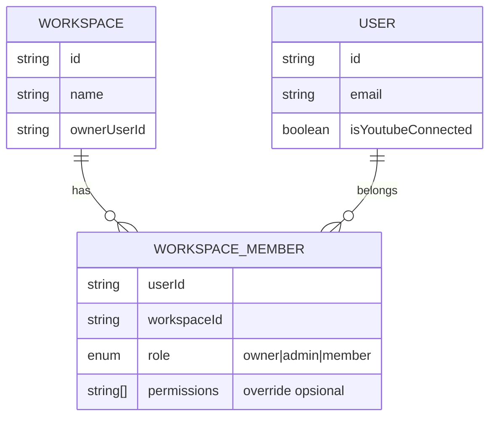
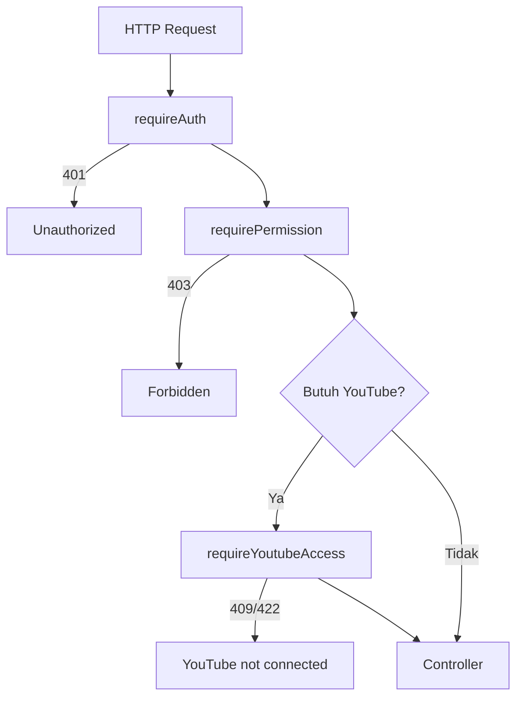

# 02 - RBAC & Auth: Spesifikasi Final

> Dokumen ini adalah **sumber kebenaran** untuk auth, RBAC, middleware, dan kebijakan YouTube di backend v2.

---

## 1. Prinsip Dasar

1. **Fitur inti** (`video-analysis`, `configuration`, `profile`, `channel`, dll.) hanya untuk user Judi Guard yang sudah **login**.
2. **`guest` bukan role** — hanya status publik (belum autentikasi).
3. **RBAC granular** — endpoint dicek via permission, bukan hanya role string.
4. **`member` dan `admin` wajib YouTube terkoneksi** untuk operasi channel & moderasi.
5. **`owner`** mengelola workspace: anggota, role, dan override permission fitur.

---

## 2. Model Workspace



### Fase implementasi

| Fase                  | Cakupan                                                                 |
| --------------------- | ----------------------------------------------------------------------- |
| **Fase 1 (sekarang)** | Satu user = satu workspace implisit; field `role` di `User`             |
| **Fase 2**            | Tabel/koleksi `Workspace` + `WorkspaceMember`; multi-user per workspace |
| **Fase 3**            | Owner assign permission granular per member                             |

---

## 3. Role & Hierarki

| Role         | Deskripsi                                                                          | YouTube wajib?                                                           |
| ------------ | ---------------------------------------------------------------------------------- | ------------------------------------------------------------------------ |
| **`owner`**  | Pemilik workspace; kelola member/admin, assign/revoke permission, billing (future) | Tidak untuk operasi kelola tim; **ya** jika pakai fitur analisis sendiri |
| **`admin`**  | Operasional workspace; moderasi, config, analisis                                  | **Ya**                                                                   |
| **`member`** | Pengguna harian; analisis & moderasi sesuai permission                             | **Ya**                                                                   |

### Hierarki (untuk fallback role-only)

```
owner ⊃ admin ⊃ member
```

Owner mewarisi semua permission `admin` + permission khusus `workspace:*` dan `rbac:*`.

---

## 4. Permission Granular

### 4.1 Namespace permission

| Namespace     | Permission               | Deskripsi                             |
| ------------- | ------------------------ | ------------------------------------- |
| **profile**   | `profile:read`           | Lihat profil sendiri                  |
|               | `profile:write`          | Edit profil sendiri                   |
| **analysis**  | `analysis:start`         | Mulai analisis video                  |
|               | `analysis:read`          | Lihat status & hasil                  |
|               | `analysis:moderate`      | Hapus/reject komentar via YouTube API |
|               | `analysis:report`        | Unduh laporan PDF                     |
| **config**    | `config:read`            | Lihat whitelist/blacklist             |
|               | `config:write`           | Ubah whitelist/blacklist              |
| **channel**   | `channel:read`           | List video & preview komentar         |
| **youtube**   | `youtube:connect`        | OAuth connect/disconnect channel      |
| **workspace** | `workspace:read`         | Lihat anggota workspace               |
|               | `workspace:invite`       | Undang/tambah member (manual)         |
|               | `workspace:remove`       | Hapus member dari workspace           |
|               | `workspace:assign-role`  | Ubah role member (admin/member)       |
| **rbac**      | `rbac:assign-permission` | Override permission per user          |
|               | `rbac:revoke-permission` | Cabut permission override             |

### 4.2 Default permission per role

| Permission               | owner |    admin     |    member    |
| ------------------------ | :---: | :----------: | :----------: |
| `profile:read`           |  ✅   |      ✅      |      ✅      |
| `profile:write`          |  ✅   |      ✅      |      ✅      |
| `analysis:start`         |  ✅   |      ✅      |      ✅      |
| `analysis:read`          |  ✅   |      ✅      |      ✅      |
| `analysis:moderate`      |  ✅   |      ✅      |      ✅      |
| `analysis:report`        |  ✅   |      ✅      |      ✅      |
| `config:read`            |  ✅   |      ✅      |      ✅      |
| `config:write`           |  ✅   |      ✅      | ⚠️ opsional* |
| `channel:read`           |  ✅   |      ✅      |      ✅      |
| `youtube:connect`        |  ✅   |      ✅      |      ✅      |
| `workspace:read`         |  ✅   |      ✅      |      ❌      |
| `workspace:invite`       |  ✅   | ⚠️ opsional* |      ❌      |
| `workspace:remove`       |  ✅   |      ❌      |      ❌      |
| `workspace:assign-role`  |  ✅   |      ❌      |      ❌      |
| `rbac:assign-permission` |  ✅   |      ❌      |      ❌      |
| `rbac:revoke-permission` |  ✅   |      ❌      |      ❌      |

\* Owner bisa override via `WorkspaceMember.permissions` — mis. member boleh `config:write`, admin boleh `workspace:invite`.

### 4.3 Evaluasi permission (pseudocode)

```javascript
function hasPermission(user, workspaceId, permission) {
  const membership = getMembership(user.id, workspaceId);
  if (!membership) return false;

  // 1. Cek override eksplisit (grant/deny)
  if (membership.permissionOverrides?.deny?.includes(permission)) return false;
  if (membership.permissionOverrides?.grant?.includes(permission)) return true;

  // 2. Fallback ke default role
  return DEFAULT_PERMISSIONS[membership.role]?.includes(permission) ?? false;
}
```

---

## 5. Kebijakan Guest (G1)

| Endpoint                                                            | Akses guest                             |
| ------------------------------------------------------------------- | --------------------------------------- |
| `GET /api/health`                                                   | ✅                                      |
| `POST /api/auth/register`, `/login`, `/verify-otp`, dll.            | ✅                                      |
| `POST /api/predict` (demo teks homepage)                            | ✅ (opsional, rate-limited)             |
| `/api/auth/guest/*`                                                 | ❌ **deprecate** — hapus dari flow inti |
| `/api/analysis/*`, `/api/config/*`, `/api/users/*`, `/api/videos/*` | ❌                                      |

---

## 6. Middleware Chain (Final)



### 6.1 Middleware & tanggung jawab

| Middleware                    | File target                 | Output di `req`                                    |
| ----------------------------- | --------------------------- | -------------------------------------------------- |
| `requireAuth`                 | `require-auth.js`           | `req.auth = { userId, email, workspaceId, role }`  |
| `requirePermission(...perms)` | `require-permission.js`     | — (throw 403 jika gagal)                           |
| `requireYoutubeAccess`        | `require-youtube-access.js` | `req.youtube = { tokens, channelId, channelName }` |
| `requireResourceOwnership`    | `require-ownership.js`      | — (cek analysis/resource milik user/workspace)     |

### 6.2 Aturan `requireYoutubeAccess`

- **Hanya** baca token YouTube dari user yang sudah `requireAuth` (DB: `youtubeAccessToken`, dll.).
- **Tidak ada** fallback `guest_session` cookie.
- Wajib untuk:
  - `channel:*`
  - `analysis:start`, `analysis:moderate`
  - `config:*` (karena whitelist/blacklist terikat channel)
- Scope OAuth minimum: `youtube.force-ssl` (lihat [youtube_data_api_v3.md](../../youtube_data_api_v3.md)).

### 6.3 Kode HTTP error

| Kondisi                               | Status | Pesan contoh                              |
| ------------------------------------- | ------ | ----------------------------------------- |
| Tidak ada / token invalid JWT         | `401`  | Anda tidak login                          |
| Permission tidak cukup                | `403`  | Akses ditolak untuk aksi ini              |
| Belum connect YouTube                 | `409`  | Hubungkan akun YouTube terlebih dahulu    |
| Token YouTube expired & refresh gagal | `422`  | Sesi YouTube kedaluwarsa, hubungkan ulang |

---

## 7. Route × Permission Matrix

### 7.1 Auth & user

| Method | Path                           | Auth   | Permission        | YouTube |
| ------ | ------------------------------ | ------ | ----------------- | ------- |
| POST   | `/api/auth/register`           | Public | —                 | —       |
| POST   | `/api/auth/login`              | Public | —                 | —       |
| GET    | `/api/auth/youtube/connect`    | ✅     | `youtube:connect` | —       |
| GET    | `/api/auth/youtube/callback`   | ✅     | `youtube:connect` | —       |
| POST   | `/api/auth/youtube/disconnect` | ✅     | `youtube:connect` | —       |
| GET    | `/api/users/me`                | ✅     | `profile:read`    | —       |
| PATCH  | `/api/users/updateMe`          | ✅     | `profile:write`   | —       |

### 7.2 Video analysis (logic baru — pertahankan, hapus route lama)

| Method | Path                                   | Auth | Permission          | YouTube |
| ------ | -------------------------------------- | ---- | ------------------- | ------- |
| GET    | `/api/analysis/history`                | ✅   | `analysis:read`     | —       |
| POST   | `/api/analysis/:videoId`               | ✅   | `analysis:start`    | ✅      |
| GET    | `/api/analysis/status/:analysisId`     | ✅   | `analysis:read`     | —       |
| GET    | `/api/analysis/:analysisId/results`    | ✅   | `analysis:read`     | —       |
| POST   | `/api/analysis/:analysisId/action`     | ✅   | `analysis:moderate` | ✅      |
| POST   | `/api/analysis/:analysisId/undo`       | ✅   | `analysis:moderate` | ✅      |
| GET    | `/api/analysis/:analysisId/report/pdf` | ✅   | `analysis:report`   | —       |

**Route lama untuk di-deprecate** (logic lama, duplikat):

- `POST /api/analysis/videos`
- `GET /api/analysis/videos/:analysisId/comments`
- `DELETE /api/analysis/comments/:analyzedCommentId`
- `DELETE /api/analysis/videos/:analysisId/judi-comments`

### 7.3 Configuration & channel

| Method          | Path                    | Auth | Permission                     | YouTube |
| --------------- | ----------------------- | ---- | ------------------------------ | ------- |
| GET/POST/DELETE | `/api/config/whitelist` | ✅   | `config:read` / `config:write` | ✅      |
| GET/POST/DELETE | `/api/config/blacklist` | ✅   | `config:read` / `config:write` | ✅      |
| GET             | `/api/videos`           | ✅   | `channel:read`                 | ✅      |
| GET             | `/api/videos/search`    | ✅   | `channel:read`                 | ✅      |

### 7.4 Workspace management (owner)

| Method | Path                                         | Auth | Permission               | YouTube |
| ------ | -------------------------------------------- | ---- | ------------------------ | ------- |
| GET    | `/api/workspace/members`                     | ✅   | `workspace:read`         | —       |
| POST   | `/api/workspace/members`                     | ✅   | `workspace:invite`       | —       |
| DELETE | `/api/workspace/members/:userId`             | ✅   | `workspace:remove`       | —       |
| PATCH  | `/api/workspace/members/:userId/role`        | ✅   | `workspace:assign-role`  | —       |
| PATCH  | `/api/workspace/members/:userId/permissions` | ✅   | `rbac:assign-permission` | —       |

---

## 8. Perubahan Model Data (Fase 1)

Tambahkan ke `User` (atau `WorkspaceMember` di fase 2):

```javascript
role: {
  type: String,
  enum: ['owner', 'admin', 'member'],
  default: 'member',
},
workspaceId: { type: ObjectId, ref: 'Workspace' }, // fase 2
permissionOverrides: {
  grant: [String],
  deny: [String],
},
```

JWT payload minimal:

```javascript
{
  userId,
  email,
  role,           // role dalam workspace aktif
  workspaceId,    // fase 2
  permissions: [] // optional: cache permission efektif
}
```

---

## 9. Audit & Keamanan

Wajib audit log untuk:

- `analysis:moderate` (delete, reject, undo)
- `workspace:invite`, `workspace:remove`, `workspace:assign-role`
- `rbac:assign-permission`, `rbac:revoke-permission`
- `youtube:connect`, `youtube:disconnect`

Field audit: `actorId`, `workspaceId`, `action`, `resourceType`, `resourceId`, `metadata`, `requestId`, `timestamp`.

---

## 10. Checklist Implementasi

### Fase 1 — Auth & middleware

- [ ] Tambah field `role` di `User` (default `member`; user pertama / registrasi mandiri = `owner` workspace implisit)
- [ ] Buat `require-auth.js`, `require-permission.js`, `require-youtube-access.js`
- [ ] Hapus fallback guest di `ensure-youtube-access.js`
- [ ] Perbaiki inkonsistensi JWT payload (`userId` vs `id`)
- [ ] Terapkan matrix permission ke semua route inti
- [ ] Deprecate route analysis lama & guest auth routes
- [ ] Integration test: 401 / 403 / 409 matrix

### Fase 2 — Workspace

- [ ] Model `Workspace`, `WorkspaceMember`
- [ ] Endpoint `/api/workspace/members/*`
- [ ] Owner UI untuk kelola anggota & permission

---

## 11. Ringkasan Keputusan

| Aspek      | Keputusan final                                              |
| ---------- | ------------------------------------------------------------ |
| Role       | `owner`, `admin`, `member`                                   |
| Guest      | G1 — public only, bukan role                                 |
| Fitur inti | `member+` via permission granular                            |
| YouTube    | Wajib untuk `admin` & `member` pada operasi channel/moderasi |
| Owner      | Kelola anggota, role, override permission fitur              |
| Middleware | `requireAuth` → `requirePermission` → `requireYoutubeAccess` |

---

_Spesifikasi terkunci: Juli 2026_
