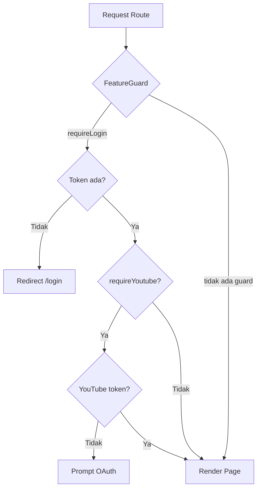
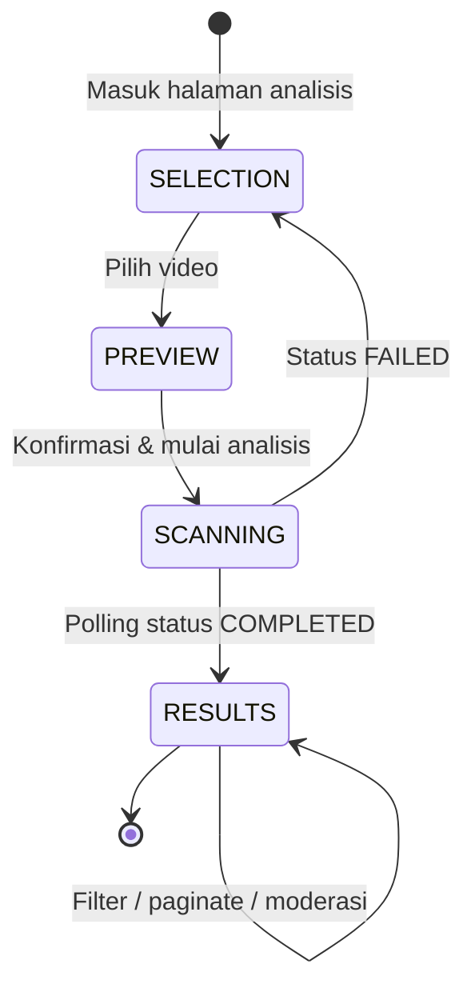

# Judi Guard — Dokumentasi Frontend (Kondisi Saat Ini)

> Sumber kebenaran teknis mengenai keadaan saat ini untuk `packages/frontend/`.  
> Untuk spesifikasi target arsitektur dan rencana pelaksanaan migrasi, lihat [Spesifikasi Migrasi ke Feature Modules (v2)](v2/01-migrasi-feature-module-spesifikasi.md).  
> Kembali ke [dokumentasi global](../README.md).

---

## 1. Ringkasan

Frontend Judi Guard adalah **Single Page Application (SPA)** berbasis **React 19 + Vite** yang menyediakan antarmuka untuk:

- Landing page & informasi produk
- Autentikasi (login, register, OTP, reset password)
- Analisis komentar video YouTube (guest & logged-in)
- Creator dashboard (overview, analisis, riwayat, konfigurasi)
- Prediksi teks demo (homepage)
- Manajemen profil pengguna

---

## 2. Teknologi

| Komponen       | Pilihan                  | Versi |
| -------------- | ------------------------ | ----- |
| Framework      | React                    | 19.x  |
| Build tool     | Vite                     | 6.x   |
| Styling        | Tailwind CSS + shadcn/ui | —     |
| Routing        | React Router DOM         | v7    |
| HTTP Client    | Axios                    | —     |
| Server State   | TanStack Query           | —     |
| State (UI)     | Zustand                  | —     |
| Animasi        | GSAP, Framer Motion      | —     |
| Testing        | Vitest + Testing Library | —     |
| E2E            | Cypress (di root repo)   | —     |
| Linting        | ESLint + Prettier        | —     |

---

## 3. Arsitektur Kode Saat Ini (Feature Module Architecture)

Struktur file di dalam `packages/frontend/src/` diatur berdasarkan **domain fitur** (_feature-based_):

```bash
packages/frontend/src/
├── assets/                         # Ikon, gambar, font
├── constants/                      # Data statis & nilai konstan
├── routes/                         # Thin routing layer
│   ├── AppRouter.jsx
│   └── ProtectedRoute.jsx
├── modules/
│   ├── auth/                       # Login, register, OTP, reset password
│   ├── video-analysis/             # Analisis komentar video
│   ├── overview/                   # Dashboard landing
│   ├── guide/                      # Panduan penggunaan
│   ├── configuration/              # Whitelist & blacklist
│   ├── profile/                    # Profil pengguna
│   ├── home/                       # Landing page & prediksi teks demo
│   └── history/                    # Riwayat analisis & laporan
├── shared/
│   ├── api-client/                 # Axios instance terpusat (JWT, workspace, 401)
│   ├── components/                 # UI reusable global (layout, ui, status)
│   └── utils/                      # Helper global (formatters, formValidators, cn, motion)
├── lib/                            # Kosong — dapat dihapus. Utils sudah di shared/utils
│   └── utils/                      # → pindah ke shared/utils
├── App.jsx
└── main.jsx
```

*Detail target arsitektur dan aturan folderisasi: [Spesifikasi Migrasi (v2)](v2/01-migrasi-feature-module-spesifikasi.md).*

---

## 4. Peta Fitur & Route

### 4.1 Tabel Rute

| Path                     | Halaman              | Auth | YouTube OAuth | Layout          |
| ------------------------ | -------------------- | ---- | ------------- | --------------- |
| `/`                      | HomePage             | —    | —             | MainLayout      |
| `/about-us`              | AboutUs              | —    | —             | MainLayout      |
| `/facts`                 | FactPage             | —    | —             | MainLayout      |
| `/dashboard`             | OverviewPage         | —    | —             | DashboardLayout |
| `/dashboard/analysis`    | AnalysisPage         | ✅   | ✅            | DashboardLayout |
| `/dashboard/history`     | HistoryPage          | ✅   | —             | DashboardLayout |
| `/dashboard/config`      | ConfigPage           | ✅   | ✅            | DashboardLayout |
| `/dashboard/guide`       | GuidePage            | —    | —             | DashboardLayout |
| `/dashboard/profile`     | ProfilePage          | ✅   | —             | DashboardLayout |
| `/dashboard/profile/edit`  | EditProfilePage      | ✅   | —             | DashboardLayout |
| `/login`                 | LoginPage            | —    | —             | —               |
| `/register`              | RegisterPage         | —    | —             | —               |
| `/otp`                   | OtpPage              | —    | —             | —               |
| `/forgot-password`       | ForgotPasswordPage   | —    | —             | —               |
| `/change-password`       | ChangePasswordPage   | —    | —             | —               |
| `/reset-password/:token` | ResetPasswordPage    | —    | —             | —               |

### 4.2 Guard & Proteksi Route



---

## 5. Manajemen State Saat Ini

### 5.1 Server State (TanStack Query)

| Modul              | Hooks / Query Keys                          | Status |
| ------------------ | --------------------------------------------- | ------ |
| `auth`             | `useAuthMutations`                            | ✅     |
| `video-analysis`   | `useAnalysisQueries`                          | ✅     |
| `configuration`    | `useConfigQueries` + `configKeys`             | ✅     |
| `profile`          | `useProfileQueries`                           | ✅     |
| `home`             | `usePredictTextMutation`                      | ✅     |
| `history`          | `useHistoryQueries` + `historyKeys`           | ✅     |

### 5.2 UI State (Zustand)

| Store / Modul Store       | File                                              | Status             |
| ------------------------- | ------------------------------------------------- | ------------------ |
| `useAnalysisUiStore`      | `modules/video-analysis/stores/analysis-ui.store` | ✅ UI-only per-modul |
| `useAuthUiStore`          | `modules/auth/stores/auth-ui.store`               | ✅ UI-only per-modul |

---

## 6. Lapisan API Saat Ini

### 6.1 Shared API Client (Target)

```
shared/api-client/index.js    # JWT, X-Workspace-Id, auto-logout 401
```

### 6.2 Module API Services

| Modul              | File                                      |
| ------------------ | ----------------------------------------- |
| `auth`             | `modules/auth/services/auth.api.js`       |
| `video-analysis`   | `modules/video-analysis/services/analysis.api.js` |
| `configuration`    | `modules/configuration/services/config.api.js`    |
| `profile`          | `modules/profile/services/profile.api.js` |
| `home`             | `modules/home/services/home.api.js`       |
| `history`          | `modules/history/services/history.api.js` |

<!-- Legacy services folder deleted in Fase 3 -->

---

## 7. Komponen UI Saat Ini

| Folder                        | Deskripsi / Isi                                      |
| :---------------------------- | :--------------------------------------------------- |
| `shared/components/ui/`       | Komponen primitif shadcn/ui (Button, Dialog, Input)  |
| `shared/components/layout/`   | Tata letak global (MainLayout, DashboardLayout)      |
| `shared/components/status/`   | State halaman (NotFound, LoginRequired, dll)         |
| `modules/{feature}/components/` | Komponen khusus per modul                        |

---

## 8. Styling Saat Ini

- Menggunakan **Tailwind CSS utility classes** yang dideklarasikan secara inline di JSX.
- Ekstraksi ke file `{name}.styles.js` co-located **dilewatkan** — Tailwind inline sudah co-located, file style terpisah hanya menambah indirection.

---

## 9. Alur UI Analisis Video



---

## 10. Pengujian (Testing)

| Jenis Pengujian | Alat (Tools)                   | Lokasi Berkas                        |
| :-------------- | :----------------------------- | :----------------------------------- |
| Unit komponen   | Vitest + React Testing Library | `src/**/__tests__/*.spec.jsx`        |
| Integrasi       | Vitest                         | `*.integration.spec.jsx`             |
| End-to-End      | Cypress                        | `/cypress/` (di root repository)     |

---

## 11. Environment

```ini
# packages/frontend/.env
VITE_API_URL=http://localhost:3001
```

---

## 12. Skrip Development

| Perintah          | Fungsi                                              |
| :---------------- | :-------------------------------------------------- |
| `npm run dev`     | Menjalankan local development server (port 5173)    |
| `npm run build`   | Membuat bundel produksi di folder `dist/`           |
| `npm run preview` | Meninjau hasil build produksi                       |
| `npm run test`    | Menjalankan seluruh pengujian berbasis Vitest       |
| `npm run lint`    | Menganalisis sintaksis menggunakan ESLint           |
| `npm run cy:open` | Membuka antarmuka interaktif Cypress                |

---

_Terakhir diperbarui: Juli 2026_
