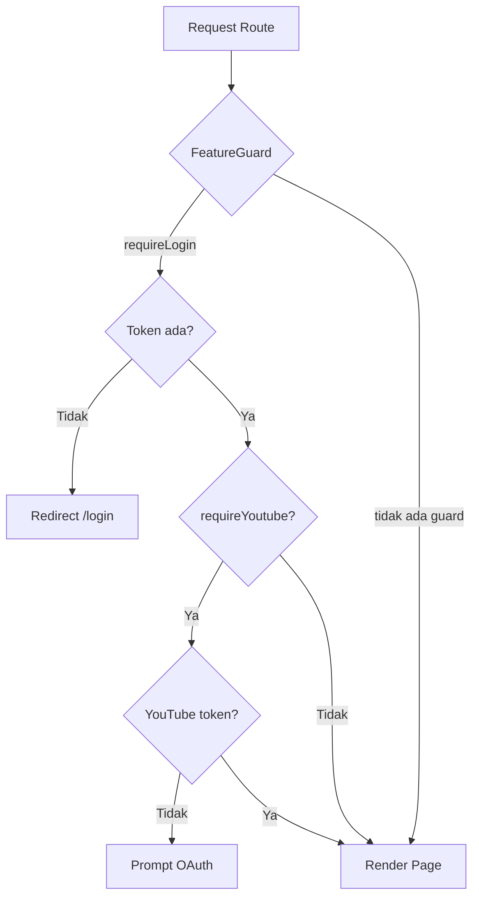
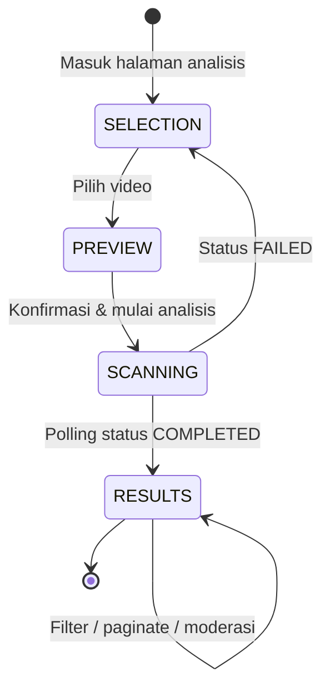

# Judi Guard — Dokumentasi Frontend (Kondisi Saat Ini)

> Sumber kebenaran teknis mengenai keadaan saat ini untuk `packages/frontend/`.  
> Untuk spesifikasi target arsitektur dan rencana pelaksanaan migrasi, lihat [Spesifikasi Migrasi ke Feature Modules (v2)](v2/01-migrasi-feature-module-spesifikasi.md).  
> Kembali ke [dokumentasi global](../README.md).

---

## 1. Ringkasan

Frontend Judi Guard adalah **Single Page Application (SPA)** berbasis **React 19 + Vite** yang menyediakan antarmuka untuk:

- Landing page & informasi produk
- Autentikasi (login, register, OTP, reset password)
- Analisis komentar video YouTube (guest & logged-in)
- Creator dashboard (overview, analisis, riwayat, konfigurasi)
- Prediksi teks demo (homepage)
- Manajemen profil pengguna

---

## 2. Teknologi

| Komponen    | Pilihan                  | Versi |
| ----------- | ------------------------ | ----- |
| Framework   | React                    | 19.x  |
| Build tool  | Vite                     | 6.x   |
| Styling     | Tailwind CSS + shadcn/ui | —     |
| Routing     | React Router DOM         | v7    |
| HTTP Client | Axios                    | —     |
| State (UI)  | Zustand                  | —     |
| Animasi     | GSAP, Framer Motion      | —     |
| Testing     | Vitest + Testing Library | —     |
| E2E         | Cypress (di root repo)   | —     |
| Linting     | ESLint + Prettier        | —     |

---

## 3. Arsitektur Kode Saat Ini (Layer-Based MVP)

Struktur file di dalam `packages/frontend/src/` saat ini diatur berdasarkan **tipe teknis** (*layer-based*):

```bash
packages/frontend/src/
├── assets/                 # Ikon, gambar, font
├── components/             # Komponen UI global/per-domain
├── constants/              # Data statis & nilai konstan
├── hooks/                  # Custom React hooks
├── lib/
│   ├── services/           # Logika pemanggilan API (Axios client & request)
│   └── utils/              # Validator formulir & formatting helper
├── pages/                  # Komponen halaman untuk routing
├── routes/                 # Konfigurasi routing (AppRouter, ProtectedRoute)
├── stores/                 # Zustand global stores (mencampur UI & Server State)
├── App.jsx
└── main.jsx
```

*Untuk melihat arsitektur target (**Feature Module Architecture**), silakan merujuk pada [Dokumen Spesifikasi Migrasi (v2)](v2/01-migrasi-feature-module-spesifikasi.md).*

---

## 4. Peta Fitur & Route

### 4.1 Tabel Rute

| Path                     | Halaman              | Auth | YouTube OAuth | Layout          |
| ------------------------ | -------------------- | ---- | ------------- | --------------- |
| `/`                      | HomePage             | —    | —             | MainLayout      |
| `/analysis`              | AnalysisPage (guest) | —    | —             | MainLayout      |
| `/profile`               | ProfilePage          | —    | —             | MainLayout      |
| `/profile/edit`          | EditProfilePage      | —    | —             | MainLayout      |
| `/about-us`              | AboutUs              | —    | —             | MainLayout      |
| `/facts`                 | FactPage             | —    | —             | MainLayout      |
| `/dashboard`             | OverviewPage         | —    | —             | DashboardLayout |
| `/dashboard/analysis`    | AnalysisPage         | ✅   | ✅            | DashboardLayout |
| `/dashboard/history`     | HistoryPage          | ✅   | —             | DashboardLayout |
| `/dashboard/config`      | ConfigPage           | ✅   | ✅            | DashboardLayout |
| `/dashboard/guide`       | GuidePage            | —    | —             | DashboardLayout |
| `/login`                 | LoginPage            | —    | —             | —               |
| `/register`              | RegisterPage         | —    | —             | —               |
| `/otp`                   | OtpPage              | —    | —             | —               |
| `/forgot-password`       | ForgotPasswordPage   | —    | —             | —               |
| `/change-password`       | ChangePasswordPage   | —    | —             | —               |
| `/reset-password/:token` | ResetPasswordPage    | —    | —             | —               |

### 4.2 Guard & Proteksi Route



---

## 5. Manajemen State Saat Ini

Keadaan state management saat ini sebagian besar dikelola oleh **Zustand store** yang mencampur server data fetching dan UI flags secara bersamaan:

| Store                | File                           | Server State                           | UI State          | Status             |
| -------------------- | ------------------------------ | -------------------------------------- | ----------------- | ------------------ |
| `authStore`          | `stores/authStore.js`          | Token, user data                       | Loading flags     | ⚠️ Campur          |
| `videoAnalysisStore` | `stores/videoAnalysisStore.js` | `myVideos`, `comments`, hasil analisis | `step`, `filters` | ⚠️ Campur          |
| `textPredictStore`   | `stores/textPredictStore.js`   | Hasil prediksi                         | Input text        | ⚠️ Campur          |
| `userStore`          | `stores/userStore.js`          | Profil user                            | —                 | ⚠️ Server di store |
| `configStore`        | `stores/configStore.js`        | Whitelist/blacklist                    | —                 | ⚠️ Server di store |
| `historyStore`       | `stores/historyStore.js`       | Riwayat analisis                       | Filter/pagination | ⚠️ Campur          |
| `youtubeStore`       | `stores/youtubeStore.js`       | OAuth state                            | —                 | ⚠️ Campur          |

*Tujuan migrasi memisahkan Server State ke **TanStack Query** dan menyisakan UI State di **Zustand per modul**. Lihat detail di [Spesifikasi Migrasi State (v2)](v2/01-migrasi-feature-module-spesifikasi.md#3-target-state-management-zustand-vs-tanstack-query).*

---

## 6. Lapisan API Saat Ini

Seluruh request API saat ini ditampung secara terpusat di dalam folder `src/lib/services/`:

```
lib/services/
├── apiClient.js          # Axios instance + interceptors (JWT, default workspace)
├── authApi.js            # API khusus autentikasi
├── userApi.js            # API data user
├── videoAnalysisApi.js   # API analisis video & komentar
├── channelApi.js         # API data channel
├── configApi.js          # API konfigurasi filter kata kunci
├── historyApi.js         # API riwayat scan
├── predictTextApi.js     # API prediksi manual/demo teks
├── youtubeApi.js         # API integrasi OAuth Google/YouTube
└── managePasswordApi.js  # API manajemen reset/lupa kata sandi
```

---

## 7. Komponen UI Saat Ini

Komponen-komponen UI diklasifikasikan ke dalam folder-folder berikut:

| Folder | Deskripsi / Isi | Konsumen Utama |
| :--- | :--- | :--- |
| `components/ui/` | Komponen primitif dari **shadcn/ui** (Button, Dialog, Input) | Seluruh aplikasi |
| `components/layout/` | Tata letak global (`MainLayout`, `DashboardLayout`) | Berkas rute utama |
| `components/auth/` | Formulir login, register, dan reset password | Halaman `/pages/auth/*` |
| `components/analysis/` | Formulir input, list komentar, dan box statistik | Halaman analisis |

---

## 8. Styling Saat Ini

- Menggunakan **Tailwind CSS utility classes** yang dideklarasikan secara inline di JSX.
- Kelas-kelas Tailwind yang bertumpuk panjang mempersulit keterbacaan struktur HTML.
- Berkas `tailwind.config.js` mengatur tema warna dasar, font, dan kustomisasi plugin animasi.

---

## 9. Alur UI Analisis Video



---

## 10. Pengujian (Testing)

| Jenis Pengujian | Alat (Tools) | Lokasi Berkas |
| :--- | :--- | :--- |
| Unit komponen | Vitest + React Testing Library | `src/**/__tests__/*.spec.jsx` |
| Unit store | Vitest | `src/stores/__tests__/` |
| Unit service | Vitest | `src/lib/services/__tests__/` |
| Integrasi | Vitest | `*.integration.spec.jsx` |
| End-to-End (E2E) | Cypress | `/cypress/` (di root repository) |

---

## 11. Environment

```ini
# packages/frontend/.env
VITE_API_URL=http://localhost:3001
```

---

## 12. Skrip Development

| Perintah | Fungsi |
| :--- | :--- |
| `npm run dev` | Menjalankan local development server (default port 5173) |
| `npm run build` | Membuat bundel produksi di folder `dist/` |
| `npm run preview` | Menjalankan server lokal untuk meninjau hasil build produksi |
| `npm run test` | Menjalankan seluruh pengujian berbasis Vitest |
| `npm run lint` | Menganalisis sintaksis menggunakan ESLint |
| `npm run cy:open` | Membuka antarmuka interaktif Cypress |

---

_Terakhir diperbarui: Juli 2026_
