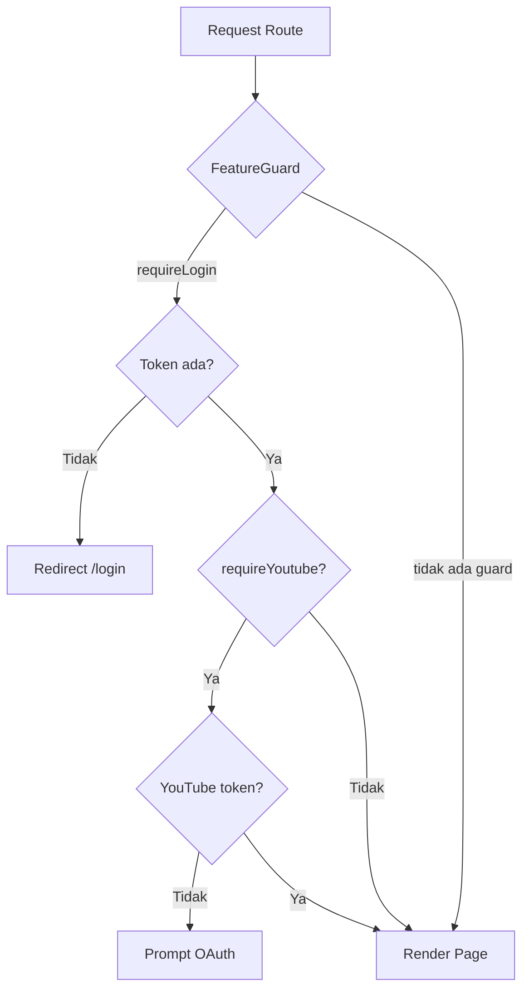
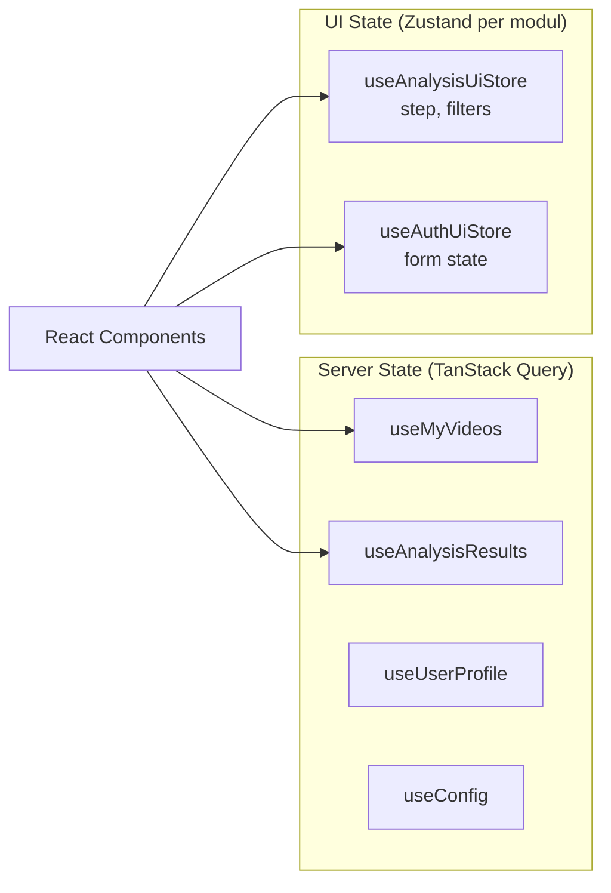
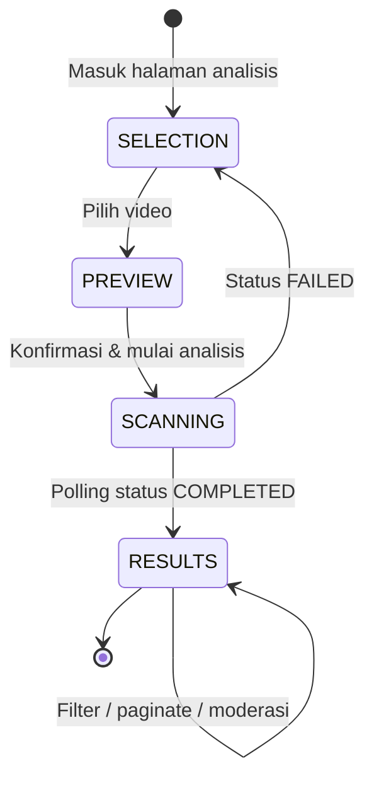

# Judi Guard — Dokumentasi Frontend (Source of Truth)

> Sumber kebenaran teknis untuk `packages/frontend/`.  
> Mengacu pada skill **frontend-architecture** (feature modules, state split, barrel imports).  
> Kembali ke [dokumentasi global](../README.md).

---

## 1. Ringkasan

Frontend Judi Guard adalah **Single Page Application (SPA)** berbasis **React 19 + Vite** yang menyediakan antarmuka untuk:

- Landing page & informasi produk
- Autentikasi (login, register, OTP, reset password)
- Analisis komentar video YouTube (guest & logged-in)
- Dashboard kreator (overview, analisis, riwayat, konfigurasi)
- Prediksi teks demo (homepage)
- Manajemen profil pengguna

---

## 2. Teknologi

| Komponen | Pilihan | Versi |
| --- | --- | --- |
| Framework | React | 19.x |
| Build tool | Vite | 6.x |
| Styling | Tailwind CSS + shadcn/ui | — |
| Routing | React Router DOM | v7 |
| HTTP Client | Axios | — |
| State (UI) | Zustand | — |
| Animasi | GSAP, Framer Motion | — |
| Testing | Vitest + Testing Library | — |
| E2E | Cypress (di root repo) | — |
| Linting | ESLint + Prettier | — |

---

## 3. Arsitektur Saat Ini vs Target

### 3.1 Kondisi Saat Ini (Layer-Based MVP)

```bash
packages/frontend/src/
├── assets/                 # Ikon, gambar
├── components/             # UI per domain (auth, analysis, layout, ui)
├── constants/              # Data statis
├── hooks/                  # Custom hooks per fitur
├── lib/
│   ├── services/           # API calls (Axios)
│   └── utils/              # Formatter, validator
├── pages/                  # Halaman per route
├── routes/                 # AppRouter, ProtectedRoute
├── stores/                 # Zustand stores
├── App.jsx
└── main.jsx
```

**Karakteristik:**
- Organisasi berdasarkan **tipe teknis** (components, hooks, stores)
- Store Zustand **mencampur server state dan UI state** (fetch API di dalam store)
- Import lintas fitur via path dalam (`@/components/...`, `@/stores/...`)
- Styling Tailwind **inline di JSX** (belum co-located styles file)

### 3.2 Target (Feature Module Architecture)

```bash
packages/frontend/src/
├── routes/                         # Thin routing layer
│   └── AppRouter.jsx
├── modules/
│   ├── auth/
│   │   ├── index.ts                # PUBLIC BARREL
│   │   ├── pages/
│   │   │   ├── login/
│   │   │   │   ├── login.tsx
│   │   │   │   ├── login.styles.ts
│   │   │   │   └── index.ts
│   │   │   └── register/
│   │   ├── components/             # Dipakai 2+ halaman dalam modul
│   │   ├── hooks/                  # useLogin, useRegister
│   │   ├── stores/                 # authUi.store.ts (UI only)
│   │   ├── services/               # authApi.ts
│   │   └── types/
│   ├── video-analysis/
│   ├── dashboard/
│   ├── profile/
│   └── home/
└── shared/
    ├── components/                 # Button, Dialog (2+ modul)
    ├── api-client/                 # Axios instance terpusat
    ├── hooks/
    └── utils/
```

---

## 4. Peta Fitur & Route

### 4.1 Route Table

| Path | Halaman | Auth | YouTube OAuth | Layout |
| --- | --- | --- | --- | --- |
| `/` | HomePage | — | — | MainLayout |
| `/analysis` | AnalysisPage (guest) | — | — | MainLayout |
| `/profile` | ProfilePage | — | — | MainLayout |
| `/profile/edit` | EditProfilePage | — | — | MainLayout |
| `/about-us` | AboutUs | — | — | MainLayout |
| `/facts` | FactPage | — | — | MainLayout |
| `/dashboard` | OverviewPage | — | — | DashboardLayout |
| `/dashboard/analysis` | AnalysisPage | ✅ | ✅ | DashboardLayout |
| `/dashboard/history` | HistoryPage | ✅ | — | DashboardLayout |
| `/dashboard/config` | ConfigPage | ✅ | ✅ | DashboardLayout |
| `/dashboard/guide` | GuidePage | — | — | DashboardLayout |
| `/login` | LoginPage | — | — | — |
| `/register` | RegisterPage | — | — | — |
| `/otp` | OtpPage | — | — | — |
| `/forgot-password` | ForgotPasswordPage | — | — | — |
| `/change-password` | ChangePasswordPage | — | — | — |
| `/reset-password/:token` | ResetPasswordPage | — | — | — |

### 4.2 Guard & Proteksi Route



---

## 5. Manajemen State

### 5.1 Aturan Wajib (frontend-architecture)

| Jenis State | Contoh | Harus di | Larangan |
| --- | --- | --- | --- |
| **Server state** | Daftar video, hasil analisis, profil user | Query layer (TanStack Query) | Jangan di Zustand |
| **UI state** | Step wizard, filter tabel, dialog terbuka | Zustand per modul | Jangan fetch di sini |

### 5.2 Kondisi Saat Ini (Perlu Perbaikan)

| Store | File | Server State | UI State | Status |
| --- | --- | --- | --- | --- |
| `authStore` | `stores/authStore.js` | Token, user data | Loading flags | ⚠️ Campur |
| `videoAnalysisStore` | `stores/videoAnalysisStore.js` | `myVideos`, `comments`, hasil analisis | `step`, `filters` | ⚠️ Campur |
| `textPredictStore` | `stores/textPredictStore.js` | Hasil prediksi | Input text | ⚠️ Campur |
| `userStore` | `stores/userStore.js` | Profil user | — | ⚠️ Server di store |
| `configStore` | `stores/configStore.js` | Whitelist/blacklist | — | ⚠️ Server di store |
| `historyStore` | `stores/historyStore.js` | Riwayat analisis | Filter/pagination | ⚠️ Campur |
| `youtubeStore` | `stores/youtubeStore.js` | OAuth state | — | ⚠️ Campur |

### 5.3 Target Migrasi State



**Contoh target `useAnalysisUiStore`:**

```typescript
// modules/video-analysis/stores/analysis-ui.store.ts
export interface IAnalysisUiState {
  step: 'SELECTION' | 'PREVIEW' | 'SCANNING' | 'RESULTS';
  filters: { page: number; limit: number; riskLevel: string; search: string };
  setStep: (step: IAnalysisUiState['step']) => void;
  setFilters: (filters: Partial<IAnalysisUiState['filters']>) => void;
  reset: () => void;
}
```

**Contoh target data hook:**

```typescript
// modules/video-analysis/hooks/useAnalysisResults.ts
export const analysisKeys = {
  all: ['analysis'] as const,
  detail: (id: string) => [...analysisKeys.all, id] as const,
  results: (id: string, filters: IFilters) =>
    [...analysisKeys.detail(id), 'results', filters] as const,
};

export const useAnalysisResults = (id: string, filters: IFilters) =>
  useQuery({
    queryKey: analysisKeys.results(id, filters),
    queryFn: () => getAnalysisResultsApi(id, filters),
  });
```

---

## 6. Lapisan API

### 6.1 Saat Ini

```
lib/services/
├── apiClient.js          # Axios instance + interceptors
├── authApi.js
├── userApi.js
├── videoAnalysisApi.js
├── channelApi.js
├── configApi.js
├── historyApi.js
├── predictTextApi.js
├── youtubeApi.js
└── managePasswordApi.js
```

**`apiClient.js`:**
- Base URL: `VITE_API_URL/api`
- Interceptor: inject JWT dari `localStorage`
- Auto-logout pada response 401

### 6.2 Target

```
shared/api-client/
└── index.ts              # Satu typed client

modules/{feature}/services/
└── {feature}.api.ts      # Wrapper per modul

modules/{feature}/hooks/
└── use{Feature}.ts       # Query/mutation hooks
```

---

## 7. Komponen & Promosi

### 7.1 Aturan Promosi (frontend-architecture §9)

| Dipakai oleh | Lokasi | Import |
| --- | --- | --- |
| 1 halaman saja | `pages/{page}/components/` | Relatif dalam page |
| 2+ halaman dalam modul | `modules/{feature}/components/` | Via barrel modul |
| 2+ modul | `shared/components/` | `@/shared/components` |

### 7.2 Komponen Shared Saat Ini

| Folder | Isi | Konsumen |
| --- | --- | --- |
| `components/ui/` | shadcn/ui (Button, Dialog, dll.) | Seluruh app |
| `components/layout/` | MainLayout, DashboardLayout | Routes |
| `components/auth/` | LoginForm, RegisterForm | Auth pages |
| `components/analysis/` | AnalysisForm, CommentList, StatBox | Analysis pages |

---

## 8. Styling

### 8.1 Saat Ini

- Tailwind utility classes **inline di JSX**
- `style.css` global untuk base styles
- `tailwind.config.js` untuk tema & plugin
- shadcn/ui via `components.json`

### 8.2 Target (Co-located Styles)

Setiap page/component memiliki `{name}.styles.ts`:

```typescript
// pages/analysis/analysis.styles.ts
import { cn } from '@/shared/utils/cn';

export const analysisStyles = {
  page: 'flex flex-col gap-8 p-6',
  header: 'flex flex-col gap-1.5',
  title: 'text-3xl font-semibold tracking-tight',
  stepIndicator: (active: boolean) =>
    cn('h-2 rounded-full transition-all', active ? 'bg-primary w-8' : 'bg-muted w-2'),
} as const;
```

---

## 9. Alur UI Analisis Video



| Step | UI State (`step`) | Aksi Store/API |
| --- | --- | --- |
| SELECTION | Pilih dari daftar video channel | `fetchMyVideos()` |
| PREVIEW | Preview komentar mentah | `fetchPreviewComments()` |
| SCANNING | Loading + polling | `startAnalysis()` → poll `getAnalysisStatus()` |
| RESULTS | Tabel komentar + aksi moderasi | `fetchResults()`, `executeAction()` |

---

## 10. Testing

| Jenis | Tool | Lokasi |
| --- | --- | --- |
| Unit komponen | Vitest + Testing Library | `src/**/__tests__/*.spec.jsx` |
| Unit store | Vitest | `src/stores/__tests__/` |
| Unit service | Vitest | `src/lib/services/__tests__/` |
| Integration | Vitest | `*.integration.spec.jsx` |
| E2E BDD | Cypress | `cypress/` (root repo) |

### 10.1 Konvensi Penamaan Test

| Suffix | Tujuan |
| --- | --- |
| `*.spec.jsx` | Unit test komponen/fungsi |
| `*.integration.spec.jsx` | Integration test (komponen + store/service) |

---

## 11. Environment

```ini
# packages/frontend/.env
VITE_API_URL=http://localhost:3001
```

> Variabel Vite **wajib** diawali `VITE_` agar tersedia di `import.meta.env`.

---

## 12. Skrip Development

| Perintah | Fungsi |
| --- | --- |
| `npm run dev` | Dev server (port 5173) |
| `npm run build` | Production build → `dist/` |
| `npm run preview` | Preview build lokal |
| `npm run test` | Vitest |
| `npm run lint` | ESLint |
| `npm run cy:open` | Cypress (dari package FE) |

---

## 13. Rencana Migrasi ke Feature Modules

### Fase 1 — Infrastruktur
- [ ] Buat `src/modules/` dan `src/shared/`
- [ ] Pindahkan `apiClient` ke `shared/api-client/`
- [ ] Install & setup TanStack Query

### Fase 2 — Modul per Fitur (prioritas)
1. `auth` — login, register, OTP, reset password
2. `video-analysis` — alur analisis utama
3. `dashboard` — overview, history, config
4. `profile` — profil user
5. `home` — landing page

### Fase 3 — State Split
- [ ] Ekstrak server state dari Zustand → Query hooks
- [ ] Sisakan UI state di Zustand per modul
- [ ] Buat key factory per modul

### Fase 4 — Styling & Barrel
- [ ] Ekstrak inline Tailwind ke `*.styles.ts`
- [ ] Buat `index.ts` barrel per modul
- [ ] Update import lintas modul → barrel only

### Fase 5 — Dokumentasi Modul
- [ ] `README.md` per modul (route, params, data deps)

---

## 14. Checklist Review (frontend-architecture §8)

- [ ] Fitur baru → `modules/{feature}/` + barrel + README
- [ ] Route baru → page directory (`{page}.tsx` + `{page}.styles.ts`)
- [ ] Cross-module import via barrel saja
- [ ] Server data di query layer, UI di store — tidak tercampur
- [ ] Tidak ada `fetch()` di komponen
- [ ] Tidak ada inline styles
- [ ] Komponen dipromosikan hanya saat ada konsumen ke-2
- [ ] Query keys dari factory hierarkis per modul

---

*Terakhir diperbarui: Juli 2026*
