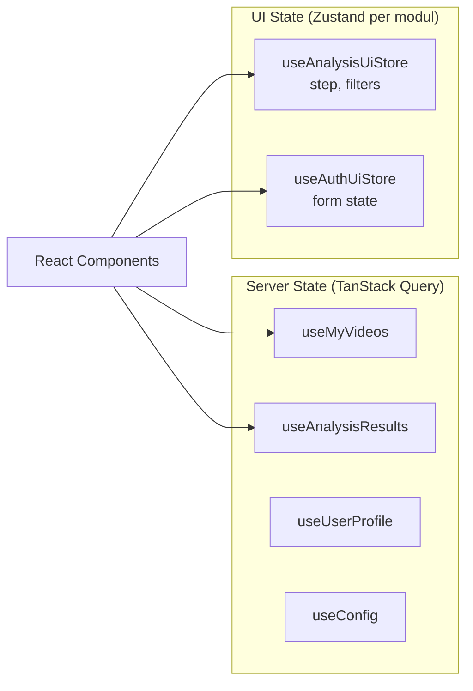
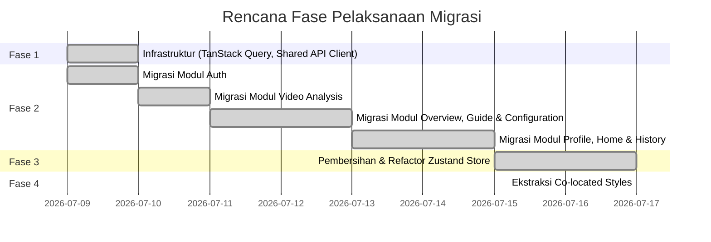

# Spesifikasi Migrasi Frontend ke Feature Module Architecture

> Dokumen spesifikasi dan panduan teknis untuk migrasi arsitektur dari pola Layer-Based MVP saat ini menuju **Feature Module Architecture**.  
> Induk dokumentasi: [README.md](../README.md)

---

## 1. Target Struktur Folder (Feature Module Architecture)

Struktur target di `packages/frontend/src/` mengelompokkan kode berdasarkan **domain fitur** (_feature-based_), bukan tipe teknis (_layer-based_):

```bash
packages/frontend/src/
├── routes/                         # Thin routing layer
│   └── AppRouter.jsx
├── modules/
│   ├── auth/
│   │   ├── index.js                # PUBLIC BARREL (Satu-satunya gerbang ekspor)
│   │   ├── pages/                  # Halaman di dalam modul
│   │   │   ├── login/
│   │   │   │   ├── LoginPage.jsx
│   │   │   │   ├── login.styles.js
│   │   │   │   └── index.js
│   │   │   └── register/
│   │   ├── components/             # Komponen yang dipakai 2+ halaman dalam modul ini
│   │   ├── hooks/                  # Custom hooks (e.g. React Query mutations)
│   │   ├── services/               # auth.api.js (Axios wrapper)
│   │   └── stores/                 # Zustand store (khusus UI state)
│   ├── video-analysis/
│   ├── overview/
│   ├── guide/
│   ├── configuration/
│   ├── profile/
│   └── home/
└── shared/
    ├── components/                 # Komponen reusable global (Button, Dialog, dll)
    ├── api-client/                 # Axios instance terpusat dengan dukungan workspace
    ├── hooks/                      # Hooks global
    └── utils/                      # Helper & validator global
```

---

## 2. Panduan Folderisasi Modul Pragmatis

Untuk meningkatkan produktivitas dan mencegah boilerplate berlebih (_over-engineering_), pemisahan subfolder di dalam modul disesuaikan dengan skala kompleksitas modul:

1. **Modul Kompleks (Contoh: `auth`)**:
   Memisahkan folder `components/`, `hooks/`, `pages/`, dan `services/` karena memiliki banyak rute, query mutations, serta formulir terpisah.
2. **Modul Sederhana / Kecil (Contoh: `profile`)**:
   Tidak perlu membuat seluruh subfolder. File logic dapat digabung secara _flat_ di level atas modul, cukup memisahkan subfolder `pages/` jika memiliki lebih dari 1 rute:
   ```bash
   modules/profile/
   ├── index.js                     # Barrel file
   ├── profile.api.js               # API services
   ├── useProfileQuery.js           # Query Hook
   └── pages/
       ├── ProfilePage.jsx
       └── EditProfilePage.jsx
   ```

**Aturan Penentuan Folder:**

- **`pages/`**: **Wajib** dipisahkan per sub-route halaman sebagai entry point routing.
- **`components/`**: **Hanya dibuat** untuk komponen yang digunakan bersama oleh $\ge$ 2 halaman di dalam modul yang sama. Komponen eksklusif 1 halaman diletakkan berdampingan (_co-located_) dengan file halaman tersebut.
- **`hooks/` & `services/`**: **Wajib** untuk memisahkan logika server state (TanStack Query) dan call API Axios agar JSX terfokus pada UI rendering.
- **`stores/`**: **Hanya dibuat** jika modul memiliki global UI state yang kompleks (misal: multi-step form wizard). Gunakan state lokal `useState` atau React Context untuk modul sederhana.

---

## 3. Target State Management (Zustand vs TanStack Query)

### 3.1 Aturan Wajib State

- **Server State**: Disimpan di query layer menggunakan **TanStack Query** (`useQuery`, `useMutation`).
- **UI State**: Disimpan di **Zustand store** khusus per modul (tidak boleh dicampur dengan logic call API/fetch).

### 3.2 Desain Alur State



### 3.3 Struktur Contoh

#### Zustand Store khusus UI State

```javascript
// modules/video-analysis/stores/analysis-ui.store.js
import { create } from 'zustand';

export const useAnalysisUiStore = create((set) => ({
  step: 'SELECTION',
  filters: { page: 1, limit: 10, riskLevel: 'ALL', search: '' },
  setStep: (step) => set({ step }),
  setFilters: (newFilters) => set((state) => ({ filters: { ...state.filters, ...newFilters } })),
  reset: () =>
    set({ step: 'SELECTION', filters: { page: 1, limit: 10, riskLevel: 'ALL', search: '' } }),
}));
```

#### Query/Mutation Hook Factory

```javascript
// modules/video-analysis/hooks/useAnalysisResults.js
import { useQuery } from '@tanstack/react-query';
import { getAnalysisResults } from '../services/analysis.api.js';

export const analysisKeys = {
  all: ['analysis'],
  detail: (id) => [...analysisKeys.all, id],
  results: (id, filters) => [...analysisKeys.detail(id), 'results', filters],
};

export const useAnalysisResults = (id, filters) =>
  useQuery({
    queryKey: analysisKeys.results(id, filters),
    queryFn: () => getAnalysisResults(id, filters),
    enabled: !!id,
  });
```

---

## 4. Target Lapisan API (Shared API Client)

Seluruh pemanggilan API wajib dialihkan ke shared client yang tangguh:

- Path: `src/shared/api-client/index.js`
- Fitur client:
  - Menyematkan header active workspace `X-Workspace-Id` otomatis.
  - Membaca token JWT otomatis dari `localStorage`.
  - Melakukan interceptor otomatis jika menerima error status `401` (Auto-logout).

---

## 5. Target Styling (Co-located Styles) — DILEWATKAN

**Keputusan:** Ekstraksi inline Tailwind ke file `{name}.styles.js` di-skip.

**Alasan:** Tailwind CSS _adalah_ co-located styling — kelas utility dideklarasikan langsung di JSX. Memindahkannya ke file `.styles.js` terpisah hanya menambah indirection (buka file lain → lihat `className` → balik lagi ke komponen) tanpa manfaat runtime.

Prinsip: _The style definition lives where it's used._ Jika suatu komponen tidak digunakan ulang di beberapa tempat, inline className lebih mudah dibaca dan dirawat dibandingkan memisahkannya ke file terpisah.

---

## 6. Aturan Promosi Komponen

| Skenario                                            | Lokasi Penyimpanan              | Jalur Impor                          |
| :-------------------------------------------------- | :------------------------------ | :----------------------------------- |
| Digunakan oleh **1 halaman saja**                   | `pages/{page}/components/`      | Relatif langsung                     |
| Digunakan oleh **2+ halaman dalam modul yang sama** | `modules/{feature}/components/` | Barrel modul (`@/modules/{feature}`) |
| Digunakan oleh **2+ modul berbeda**                 | `shared/components/`            | `@/shared/components`                |

---

## 7. Rencana Migrasi ke Feature Modules



> **Catatan:** Fase 4 (Ekstraksi `.styles.js`) dilewatkan berdasarkan keputusan arsitektur. Tailwind inline sudah co-located. Lihat [Bagian 5](#5-target-styling-co-located-styles--dilewatkan).

### Status Review per Modul (Juli 2026)

| Modul            | Struktur Folder | API Service | TanStack Query | UI Store | Catatan                                     |
| :--------------- | :-------------: | :---------: | :------------: | :------: | :------------------------------------------ |
| `auth`           |       ✅        |     ✅      |       ✅       |    ✅    | `useAuthUiStore` — session/token UI only    |
| `video-analysis` |       ✅        |     ✅      |       ✅       |    ✅    | `useAnalysisUiStore` per-modul              |
| `overview`       |       ✅        |      —      |       —        |    —     | Halaman statis, tidak butuh API             |
| `guide`          |       ✅        |      —      |       —        |    —     | Halaman statis, tidak butuh API             |
| `configuration`  |       ✅        |     ✅      |       ✅       |    —     | `configKeys` factory pattern                |
| `profile`        |       ✅        |     ✅      |       ✅       |    —     | YouTube OAuth via `useYoutubeQueries`       |
| `home`           |       ✅        |     ✅      |       ✅       |    —     | Text predict pakai `usePredictTextMutation` |
| `history`        |       ✅        |     ✅      |       ✅       |    —     | `historyKeys` factory pattern               |
| `shared`         |       ✅        |     ✅      |       —        |    —     | `api-client`, `components`                  |

**Dihapus (Fase 3 selesai):** `stores/`, `hooks/video-analysis/`, `lib/services/`

> **Fase 4 (Co-located Styles):** Dilewatkan — Tailwind inline sudah co-located. Tidak perlu file `.styles.js` terpisah.

---

## 8. Checklist Review (QA Gate)

- [x] Seluruh file impor lintas modul menggunakan public barrel saja (`@/modules/{feature}`).
- [x] Logika server data diletakkan di TanStack Query layer, Zustand murni mengelola status antarmuka/UI.
- [x] Tidak ada pemanggilan API langsung (`fetch` atau `axios.get`) di dalam komponen JSX modul yang sudah dimigrasi.
- [x] Komponen dipromosikan ke `shared/components` hanya setelah memiliki minimal 2 modul konsumen yang berbeda.
- [x] Query keys yang dipakai terstruktur rapi menggunakan factory patterns. _(auth, video-analysis, configuration, history, profile)_
- [x] Kode inline Tailwind yang bertumpuk telah dipindahkan ke berkas style terpisah. _(Fase 4 — dilewatkan, Tailwind inline sudah co-located)_
