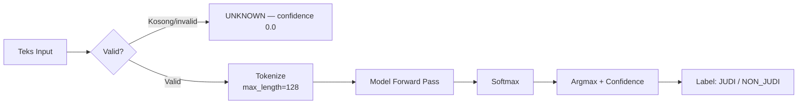
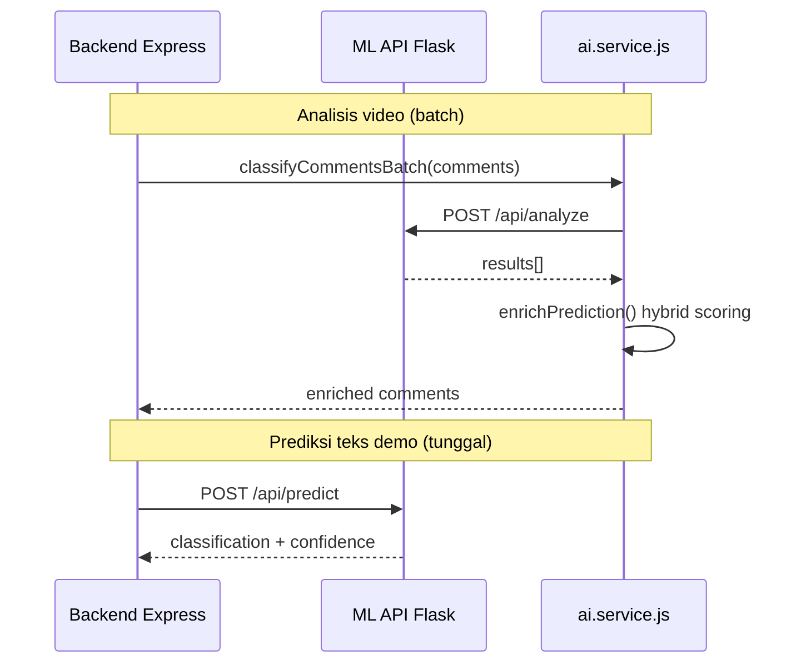
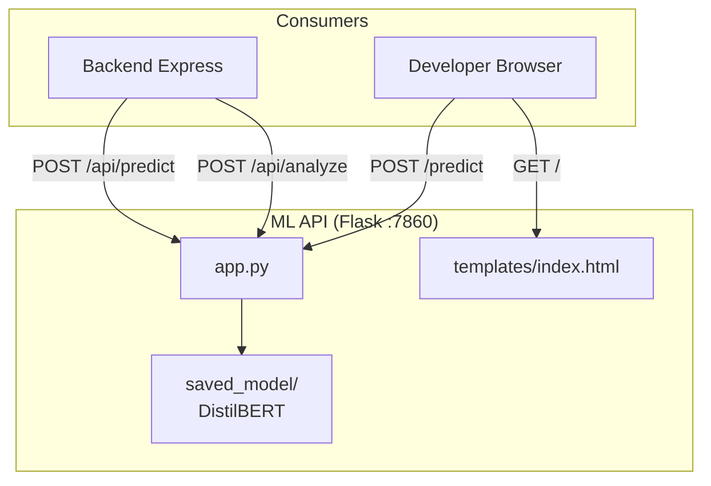

# Judi Guard — Dokumentasi ML API (Source of Truth)

> Sumber kebenaran teknis untuk `packages/ml-api/`.  
> Kembali ke [dokumentasi global](../README.md).

---

## 1. Ringkasan

**Judi Guard ML API** adalah layanan **Flask** yang menyajikan model **Machine Learning klasifikasi teks** untuk mendeteksi komentar terkait perjudian online ("Judi") vs komentar normal ("Non-Judi").

Layanan ini dirancang sebagai **microservice terpisah** dari backend Express, sehingga inferensi ML dapat di-deploy independen (mis. Hugging Face Spaces) tanpa membebani server utama.

### Dua Antarmuka

| Antarmuka | Tujuan | Konsumen |
| --- | --- | --- |
| **Web UI** | Demo & pengujian manual | Developer / QA |
| **JSON API** | Integrasi programatik | Backend Express (`ml-api.client.js`) |

---

## 2. Teknologi

| Komponen | Pilihan | Versi |
| --- | --- | --- |
| Bahasa | Python | 3.11+ |
| Framework web | Flask | latest |
| ML Framework | TensorFlow (CPU) | 2.15.0 |
| Model library | Hugging Face Transformers | 4.41.2 |
| Model arsitektur | DistilBERT Sequence Classification | `TFDistilBertForSequenceClassification` |
| Tokenizer | DistilBertTokenizerFast | — |
| WSGI server | Gunicorn | production |
| Env config | python-dotenv | — |
| Deployment | Docker → Hugging Face Spaces | port 7860 |

### Dependensi (`requirements.txt`)

```
flask
transformers==4.41.2
tensorflow-cpu==2.15.0
python-dotenv
gunicorn
```

---

## 3. Model Machine Learning

### 3.1 Spesifikasi

| Atribut | Nilai |
| --- | --- |
| Arsitektur | DistilBERT (distilled BERT) |
| Tugas | Binary text classification |
| Label 0 | `NON_JUDI` |
| Label 1 | `JUDI` |
| Max sequence length | 128 token |
| Lokasi model | `saved_model/` (lokal, via Git LFS di HF Spaces) |
| Versi (di backend) | `distilbert-flask-v1-hybrid` (env `AI_MODEL_VERSION`) |

### 3.2 Pipeline Inferensi



**Fungsi inti (`get_prediction`):**

```python
def get_prediction(text: str) -> dict:
    inputs = tokenizer(text, return_tensors='tf', truncation=True,
                       padding='max_length', max_length=128)
    outputs = model(inputs)
    probs = tf.nn.softmax(outputs.logits, axis=1)
    pred_index = tf.argmax(probs, axis=1).numpy()[0]
    confidence = tf.reduce_max(probs).numpy()
    label_map = {0: 'NON_JUDI', 1: 'JUDI'}
    return {
        'classification': label_map.get(pred_index, 'Tidak Dikenal'),
        'confidenceScore': round(float(confidence), 4),
    }
```

### 3.3 Catatan Teknis

- `TF_USE_LEGACY_KERAS=1` dipaksa di `app.py` agar kompatibel dengan `TFDistilBertForSequenceClassification` di Transformers 4.41 + TF 2.15
- Model **wajib** tersedia di `saved_model/` — aplikasi exit jika gagal load
- Teks kosong mengembalikan `UNKNOWN` dengan confidence `0.0`

---

## 4. Struktur Folder

```bash
packages/ml-api/
├── saved_model/            # Model & tokenizer (Git LFS untuk HF Spaces)
├── templates/
│   └── index.html          # UI demo web
├── app.py                  # Entry point Flask
├── Dockerfile              # Image untuk HF Spaces
├── requirements.txt        # Dependensi Python
└── README.md               # Dokumentasi singkat paket
```

---

## 5. API Contract

### 5.1 Health Check

```
GET /health
```

**Response 200:**

```json
{
  "status": "ok",
  "model_loaded": true
}
```

### 5.2 Prediksi Tunggal

```
POST /api/predict
Content-Type: application/json
```

**Request:**

```json
{
  "text": "situs gacor maxwin hari ini bosku"
}
```

**Response 200:**

```json
{
  "classification": "JUDI",
  "confidenceScore": 0.9987
}
```

**Response 400:**

```json
{
  "error": "Input JSON harus berisi key 'text'"
}
```

### 5.3 Analisis Batch

```
POST /api/analyze
Content-Type: application/json
```

**Request:**

```json
{
  "comments": [
    { "id": "mongo_id_1", "text": "situs gacor maxwin hari ini bosku" },
    { "id": "mongo_id_2", "text": "videonya keren banget kak" }
  ]
}
```

**Response 200:**

```json
{
  "status": "success",
  "total_processed": 2,
  "results": [
    { "id": "mongo_id_1", "classification": "JUDI", "confidenceScore": 0.9987 },
    { "id": "mongo_id_2", "classification": "NON_JUDI", "confidenceScore": 0.9812 }
  ]
}
```

**Response 400:**

```json
{
  "status": "error",
  "message": "Input harus memiliki array 'comments'"
}
```

### 5.4 Web UI (Demo)

| Route | Method | Fungsi |
| --- | --- | --- |
| `/` | GET | Halaman demo HTML |
| `/predict` | POST (form) | Prediksi via form web |

---

## 6. Integrasi dengan Backend



### Konfigurasi Backend

```ini
# packages/backend/.env
ML_API_URL=http://localhost:7860
```

```javascript
// packages/backend/src/shared/clients/ml-api.client.js
export const mlApiClient = axios.create({
  baseURL: process.env.ML_API_URL || 'http://127.0.0.1:5000',
  timeout: 60000,
});
```

> **Perhatian:** Default fallback di client adalah port `5000`, sedangkan ML API berjalan di port `7860`. Pastikan `ML_API_URL` diset dengan benar.

### Alur Hybrid di Backend

ML API hanya mengembalikan klasifikasi mentah. Backend menambahkan layer **hybrid scoring** di `ai.service.js`:

1. Hasil ML (`JUDI` / `NON_JUDI` + confidence)
2. + Deteksi nomor telepon (+40 skor)
3. + Deteksi link (+30 skor)
4. + Keyword judi default & blacklist user (+100 jika match)
5. − Override whitelist akun terpercaya → `NON_JUDI`
6. = `riskLevel` final (HIGH / MEDIUM / LOW / NONE)

---

## 7. Menjalankan Lokal

### 7.1 Setup Virtual Environment

```bash
cd packages/ml-api

python -m venv .venv

# Windows (PowerShell)
.\.venv\Scripts\Activate.ps1

# Linux/macOS
source .venv/bin/activate

pip install -r requirements.txt
```

### 7.2 Jalankan Server

```bash
python app.py
```

Output:

```
Memuat model dan tokenizer...
✅ Model dan tokenizer berhasil dimuat.
 * Running on http://0.0.0.0:7860
```

### 7.3 Via Docker

```bash
docker build -t judi-guard-ml .
docker run -p 7860:7860 judi-guard-ml
```

### 7.4 Via Root Monorepo

```bash
# Dari root repo (butuh venv sudah dibuat)
npm run dev:ml
```

---

## 8. Environment Variables

| Variabel | Default | Deskripsi |
| --- | --- | --- |
| `PORT` | `7860` | Port server Flask |
| `FLASK_DEBUG` | `false` | Mode debug Flask |

---

## 9. Deployment

### 9.1 Hugging Face Spaces (Docker)

Metadata di `README.md` paket:

```yaml
sdk: docker
app_port: 7860
```

**Langkah:**
1. Buat Space baru dengan SDK **Docker**
2. Push seluruh folder `ml-api/` (termasuk `saved_model/` via Git LFS)
3. HF otomatis build & deploy dari `Dockerfile`

### 9.2 Docker Compose (Monorepo)

Service `ml-api` di `docker-compose.yml` saat ini **dikomentari**. Untuk mengaktifkan:

```yaml
ml-api:
  build:
    context: ./packages/ml-api
  container_name: judiguard_ml_api
  ports:
    - "7860:7860"
  networks:
    - judiguard_network
```

Backend sudah dikonfigurasi: `ML_API_URL=http://ml-api:7860` (perlu disesuaikan port).

---

## 10. Performa & Batasan

| Aspek | Kondisi Saat Ini | Catatan |
| --- | --- | --- |
| Inferensi batch | Loop sequential per komentar | Bisa dioptimasi dengan tensor batching |
| Hardware | TensorFlow CPU only | GPU opsional untuk throughput tinggi |
| Timeout backend | 60 detik | Analisis video besar bisa timeout |
| Max token | 128 | Komentar panjang dipotong |
| Concurrency | Single Flask process | Gunakan Gunicorn multi-worker di produksi |
| Model hot-reload | Tidak ada | Restart diperlukan untuk update model |

---

## 11. Diagram Arsitektur



---

## 12. Testing Manual

### cURL — Prediksi Tunggal

```bash
curl -X POST http://localhost:7860/api/predict \
  -H "Content-Type: application/json" \
  -d '{"text": "situs gacor maxwin hari ini bosku"}'
```

### cURL — Batch

```bash
curl -X POST http://localhost:7860/api/analyze \
  -H "Content-Type: application/json" \
  -d '{"comments": [{"id": "1", "text": "situs gacor"}, {"id": "2", "text": "video bagus"}]}'
```

### cURL — Health

```bash
curl http://localhost:7860/health
```

---

## 13. Rekomendasi Peningkatan

| Area | Saat Ini | Rekomendasi |
| --- | --- | --- |
| Batch inference | Sequential loop | `model.predict_on_batch()` |
| Production server | Flask dev server | Gunicorn dengan 2–4 workers |
| Model versioning | Statis di `saved_model/` | Tag versi di response + env var |
| Monitoring | Print ke stdout | Prometheus metrics (latency, throughput) |
| Input validation | Basic key check | Pydantic schema validation |
| Rate limiting | Tidak ada | Flask-Limiter per IP |
| Contract test | Tidak ada | Pact test dengan backend |

---

*Terakhir diperbarui: Juli 2026*
